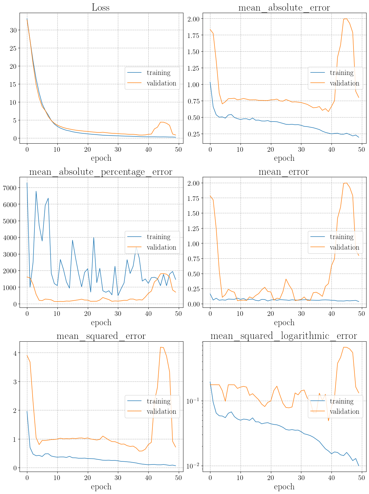

.. _DnnLik_usage:

Usage
^^^^^

We give here a brief introduction to the use of the :class:`DnnLik <DNNLikelihood.DnnLik>` class. Refer to the 
full class documentation for more details. All examples will be referred to the toy likelihood introduced in 
:ref:`the Likelihood object Usage <likelihood_usage>` section of the documentation.

A :class:`DnnLik <DNNLikelihood.DnnLik>` object is defined through a series of dictionaries (or lists of dictionaries) describing data and 
DNN inputs, optimizer, compilation, callbacks, and training parameters.
An example of the dictionaries defining the :class:`DnnLik <DNNLikelihood.DnnLik>` configurations is given by

.. code-block:: python

    model_data_inputs = {"npoints": [10000, 3000, 5000],
                     "scalerX": True,
                     "scalerY": True,
                     "weighted": False}
    model_define_inputs = {"hidden_layers": [[300, "selu"],
                                             [300, "relu"], 
                                             [300, "selu", "lecun_normal"], 
                                             [300, "relu", "glorot_uniform"]],
                           "act_func_out_layer": "linear",
                           "dropout_rate": 0,
                           "batch_norm": True}
    model_optimizer_inputs = {"name": "Adam",
                              "learning_rate": 0.001,
                              "beta_1": 0.9,
                              "beta_2": 0.999,
                              "amsgrad": False}
    model_compile_inputs = {"loss": "mse", 
                            "metrics": ["mean_squared_error", "mae", "msle", "me"]}
    model_callbacks_inputs = [{"name": "EarlyStopping",
                               "monitor": "loss",
                               "mode": "min",
                               "patience": 100,
                               "min_delta": 0.0001,
                               "restore_best_weights": True},
                              "TerminateOnNaN",
                              "PlotLossesKeras",
                              {"name": "ReduceLROnPlateau",
                               "monitor": "loss",
                               "mode": "min",
                               "factor": 0.2,
                               "min_lr": 0.00008,
                               "patience": 10,
                               "min_delta": 0.0001},
                              {"name": "ModelCheckpoint",
                               "filepath": "automatically set by the framework",
                               "monitor": "loss",
                               "mode": "min",
                               "save_best_only": True,
                               "save_freq": "epoch"}]
    model_train_inputs={"epochs": 300,
                        "batch_size": 512}

Each of the dictionaries is an input argument of the :class:`DnnLik <DNNLikelihood.DnnLik>` class (see the corresponding
documentation pages for a complete documentation: 
:argument:`model_data_inputs <DnnLik.model_data_inputs>`, :argument:`model_define_inputs <DnnLik.model_define_inputs>`,
:argument:`model_optimizer_inputs <DnnLik.model_optimizer_inputs>`, :argument:`model_compile_inputs <DnnLik.model_compile_inputs>`,
:argument:`model_callbacks_inputs <DnnLik.model_callbacks_inputs>`, :argument:`model_train_inputs <DnnLik.model_train_inputs>`).

The :argument:`model_data_inputs <DnnLik.model_data_inputs>` dictionary contains information about the way data are processed
by the DNN. In particular it specifies the number of points for training, validation, and test, if ``X`` and/or ``Y`` data 
need to be scaled through a |standard_scalers_link| and if ``Y`` data need to be weighted. These parameters are passed to the
:class:`Data <DNNLikelihood.Data>` container class that is automatically instantiated by the :class:`DnnLik <DNNLikelihood.DnnLik>`
one and that is used for data management.

The :argument:`model_define_inputs <DnnLik.model_define_inputs>` dictionary contains the main hyperparameters needed to define 
the DNN. They are given by the scruture of hidden layers each of which with number of nodes, activation function, and layer initialization,
the activation function in the last layer, the amount of dropout, the batch normalization option, and so on (in general all arguments
taken by the |tf_keras_model_link| class).

The :argument:`model_optimizer_inputs <DnnLik.model_optimizer_inputs>` dictionary is devoted to the definition of the optimizer.
The optimizer name is defined by the ``"name"`` key. All |tf_keras_optimizers_link| are supported and all optimizers arguments are
passed by the remaining items in the dictionary.

The :argument:`model_compile_inputs <DnnLik.model_compile_inputs>` dictionary defines inputs for the |tf_keras_model_compile_link|
class. The loss is passed through its name (in case of a custom loss its name need to be defined within the framework) and the metrics
that the user is interested in monitoring are passed through a list of names. Names can be passed in all formats supported by |tf_keras_link|.

Callbacks are passed through the list of dictionaries :argument:`model_callbacks_inputs <DnnLik.model_callbacks_inputs>`. All
|tf_keras_callbacks_link| are supported. One can add them just by adding their name to the list, to pass it with default arguments,
or by a dictionary containing the ``"name"`` item and all other arguments supported by that callback.

Finally, the :argument:`model_train_inputs <DnnLik.model_train_inputs>` dictionary is used to pass parameters, such as the number of
epochs and the batch size, to the |tf_keras_model_fit_link| method.

The :class:`DnnLik <DNNLikelihood.DnnLik>` object can be instantiated in three different ways, depending on the value of the arguments
:argument:`data <DnnLik.data>`, :argument:`input_data_file <DnnLik.dainput_data_fileta>`, 
and :argument:`input_data_file <DnnLik.input_summary_json_file>`. The latter argument determines whether a new object is created from
input arguments (when is set to ``None``) or the object is imported from a previously saved one (when is set to the corresponding
path). When a new object is created, data can be passed both through an already defined :class:`Data <DNNLikelihood.Data>` object 
or through the path to a previously saved one. If the path is passed, then it is always used and, if a the locally defined 
:class:`Data <DNNLikelihood.Data>` is passed, it gets ignored.

Starting from the data object we have saved in :ref:`the Data object Usage <data_usage>` section of the documentation, 
and using the arguments defined above, we can create a :class:`DnnLik <DNNLikelihood.DnnLik>` object as follows:

.. code-block:: python

    dnnlikelihood = DNNLikelihood.DnnLik(name="DNNLikelihood_toy",
                                         data=None,
                                         input_data_file="toy/data/toy_data",
                                         load_on_RAM=False,
                                         seed=1,
                                         dtype=None,
                                         same_data=True,
                                         model_data_inputs=model_data_inputs,
                                         model_define_inputs=model_define_inputs,
                                         model_optimizer_inputs=model_optimizer_inputs,
                                         model_compile_inputs=model_compile_inputs,
                                         model_callbacks_inputs=model_callbacks_inputs,
                                         model_train_inputs=model_train_inputs,
                                         resources_inputs=None,
                                         output_folder="toy/dnnlikelihood",
                                         ensemble_name=None,
                                         input_summary_json_file=None,
                                         verbose=2)

    >>> This is a 'standalone' DNNLikelihood and does not belong to a DNNLikelihood_ensemble. The attributes 'ensemble_name' and 'ensemble_folder' are therefore been set to None.
        88 CPU cores available
        2 GPUs available
        2 GPUs have been set:
        ['/device:GPU:0', 'device: 0, name: GeForce RTX 2080 Ti, pci bus id: 0000:3b:00.0, compute capability: 7.5']
        ['/device:GPU:1', 'device: 1, name: GeForce RTX 2080 Ti, pci bus id: 0000:af:00.0, compute capability: 7.5'] .
        Data object loaded in 0.015755300000002137 .
        Data log file C:\Users\Admin\Dropbox\Work\09_Resources\Git\GitHub\DNNLikelihood\DNNLikelihood_dev_tutorials\tutorials\toy\toy\data\toy_data.log updated in 0.004684999999994943 s.
        Optimizer set to: optimizers.Adam(learning_rate=0.001, beta_1=0.9, beta_2=0.999, amsgrad=False)
        Loss set to: mse
        Setting metrics
        	Added metric: mean_squared_error
        	Added metric: mae
        	Added metric: msle
        	Added metric: me
        Setting callbacks
        	Added callback: callbacks.TerminateOnNaN()
        	Added callback: PlotLossesKeras()
        	Added callback: callbacks.EarlyStopping(monitor='val_loss', mode='min', patience=100, min_delta=0.0001, restore_best_weights=True)
        	Added callback: callbacks.ReduceLROnPlateau(monitor='val_loss', mode='min', factor=0.2, min_lr=8e-05, patience=10, min_delta=0.0001)
        	Added callback: callbacks.ModelCheckpoint(filepath = 'C:\Users\Admin\Dropbox\Work\09_Resources\Git\GitHub\DNNLikelihood\DNNLikelihood_dev_tutorials\tutorials\toy\toy\dnnlikelihood\checkpoints\DNNLikelihood_toy_checkpoint.{epoch:02d}-{val_loss:.2f}.h5', monitor='val_loss', mode='min', save_best_only=True, save_freq='epoch')
        DnnLik json file C:\Users\Admin\Dropbox\Work\09_Resources\Git\GitHub\DNNLikelihood\DNNLikelihood_dev_tutorials\tutorials\toy\toy\dnnlikelihood\DNNLikelihood_toy_summary.json saved in 0.0020834000000036212 s.
        DnnLik log file C:\Users\Admin\Dropbox\Work\09_Resources\Git\GitHub\DNNLikelihood\DNNLikelihood_dev_tutorials\tutorials\toy\toy\dnnlikelihood\DNNLikelihood_toy.log saved in 0.00129949999999468 s.

where we used the placeholders <abs_path_to_input_data_file> and <abs_path_to_output_folder> to indicate the absolute path  to 
``input_data_file`` and ``output_folder``.

If the :argument:`name <DnnLik.name>` argument is not passed, then one is automatically generated. 
The :argument:`load_on_RAM <DnnLik.load_on_RAM>` argument is passed directly to the :class:`Data <DNNLikelihood.Data>` object (see the 
documentation of :argument:`Data.load_on_RAM <Data.load_on_RAM>`). The :argument:`seed <DnnLik.seed>` argument is used to
initialize the |numpy_link| and |tf_link| random number generators. The :argument:`output_folder <DnnLik.output_folder>` argument
is specified as usual, with a relative or absolute path, and if left unspecified, it is automatically set to the current working 
directory.

The :argument:`same_data <DnnLik.same_data>` and :argument:`ensemble_name <DnnLik.ensemble_name>` arguments 
should not be specified by the user (or left ``None``) and are automatically passed in case the 
:class:`DnnLik <DNNLikelihood.DnnLik>` object is part of a :mod:`DNNLikEnsemble <dnn_likelihood_ensemble>`.

When the object is created, resources are allocated through the hinerithed class :class:`Resources <DNNLikelihood.Resources>` (
see :ref:`Resources management <resources_module>` for details). The :argument:`datresources_inputsa <DnnLik.resources_inputs>`
should not be specified by the user (or left ``None``) since it is only used for automatic resources allocation when the object is part
of a :mod:`DNNLikEnsemble <dnn_likelihood_ensemble>` object.

The :meth:`DnnLik.__init__ <DNNLikelihood.DnnLik.__init__>` method sets several attributes, which can be seen in the following output:

.. code-block:: python

    dnnlikelihood.__dict__

    >>> ['active_gpus', [['/device:GPU:0', 'device: 0, name: GeForce RTX 2080 Ti, pci bus id: 0000:3b:00.0, compute capability: 7.5'], ['/device:GPU:1', 'device: 1, name: GeForce RTX 2080 Ti, pci bus id: 0000:af:00.0, compute capability: 7.5']]]
        ['act_func_out_layer', 'linear']
        ['available_cpu', ['/device:CPU:0', 'Intel(R) Xeon(R) Gold 6152 CPU @ 2.10GHz', 88]]
        ['available_gpus', [['/device:GPU:0', 'device: 0, name: GeForce RTX 2080 Ti, pci bus id: 0000:3b:00.0, compute capability: 7.5'], ['/device:GPU:1', 'device: 1, name: GeForce RTX 2080 Ti, pci bus id: 0000:af:00.0, compute capability: 7.5']]]
        ['batch_norm', True]
        ['batch_size', 512]
        ['callbacks', [<tensorflow.python.keras.callbacks.TerminateOnNaN object at 0x0000029E48B2F5B0>, <livelossplot.inputs.tf_keras.PlotLossesCallback object at 0x0000029E48B2F700>, <tensorflow.python.keras.callbacks.EarlyStopping object at 0x0000029E48B2F520>, <tensorflow.python.keras.callbacks.ReduceLROnPlateau object at 0x0000029E5400CBE0>, <tensorflow.python.keras.callbacks.ModelCheckpoint object at 0x0000029E5404FFD0>]]
        ['callbacks_strings', ['callbacks.TerminateOnNaN()', 'PlotLossesKeras()', "callbacks.EarlyStopping(monitor='val_loss', mode='min', patience=100, min_delta=0.0001, restore_best_weights=True)", "callbacks.ReduceLROnPlateau(monitor='val_loss', mode='min', factor=0.2, min_lr=8e-05, patience=10, min_delta=0.0001)", "callbacks.ModelCheckpoint(filepath = r'<abs_path_to_output_folder>/checkpoints/DNNLikelihood_toy_checkpoint.{epoch:02d}-{val_loss:.2f}.h5', monitor='val_loss', mode='min', save_best_only=True, save_freq='epoch')"]]
        ['data', <DNNLikelihood.data.Data object at 0x0000029E5404FE80>]
        ['dropout_rate', 0]
        ['dtype', 'float64']
        ['ensemble_folder', None]
        ['ensemble_name', None]
        ['epochs_available', 0]
        ['epochs_required', 300]
        ['figures_list', []]
        ['gpu_mode', True]
        ['hidden_layers', [[300, 'selu'], [300, 'relu'], [300, 'selu', 'lecun_normal'], [300, 'relu', 'glorot_uniform']]]
        ['history', {}]
        ['idx_test', array([], dtype=int32)]
        ['idx_train', array([], dtype=int32)]
        ['idx_val', array([], dtype=int32)]
        ['input_data_file', '<abs_path_to_input_data_file>'
        ['input_files_base_name', None]
        ['input_history_json_file', None]
        ['input_idx_h5_file', None]
        ['input_log_file', None]
        ['input_predictions_h5_file', None]
        ['input_scalers_pickle_file', None]
        ['input_summary_json_file', None]
        ['input_tf_model_h5_file', None]
        ['load_on_RAM', False]
        ['log', {'2021-01-29-09-13-49.9946': {'action': 'created'}, '2021-01-29-09-13-55.4107': {'action': 'metrics set', 'metrics': ['mean_squared_error', 'mae', 'msle', 'me']}, '2021-01-29-09-13-55.4177': {'action': 'callbacks set', 'callbacks': ['callbacks.TerminateOnNaN()', 'PlotLossesKeras()', "callbacks.EarlyStopping(monitor='val_loss', mode='min', patience=100, min_delta=0.0001, restore_best_weights=True)", "callbacks.ReduceLROnPlateau(monitor='val_loss', mode='min', factor=0.2, min_lr=8e-05, patience=10, min_delta=0.0001)", "callbacks.ModelCheckpoint(filepath = r'<abs_path_to_output_folder>/checkpoints/DNNLikelihood_toy_checkpoint.{epoch:02d}-{val_loss:.2f}.h5', monitor='val_loss', mode='min', save_best_only=True, save_freq='epoch')"]}, '2021-01-29-09-13-55.4227': {'action': 'saved summary json', 'file name': 'DNNLikelihood_toy_summary.json', 'file path': '<abs_path_to_output_folder>/DNNLikelihood_toy_summary.json'}}]
        ['loss', <function mean_squared_error at 0x0000029E4D0FC4C0>]
        ['loss_string', 'mse']
        ['metrics', [<function mean_squared_error at 0x0000029E4D0FC4C0>, <function mean_absolute_error at 0x0000029E4D0FC5E0>, <function mean_squared_logarithmic_error at 0x0000029E4D0FC820>, <bound method DnnLik.mean_error of <DNNLikelihood.dnn_likelihood.DnnLik object at 0x0000029E5404FCD0>>]]
        ['metrics_string', ['mean_squared_error', 'mae', 'msle', 'me']]
        ['model', None]
        ['name', 'DNNLikelihood_toy']
        ['ndims', 11]
        ['npoints_available', 200000]
        ['npoints_test', 5000]
        ['npoints_test_available', 60000]
        ['npoints_train', 10000]
        ['npoints_train_val_available', 140000]
        ['npoints_val', 3000]
        ['optimizer', <tensorflow.python.keras.optimizer_v2.adam.Adam object at 0x0000029E48B2B250>]
        ['optimizer_string', 'optimizers.Adam(learning_rate=0.001, beta_1=0.9, beta_2=0.999, amsgrad=False)']
        ['output_checkpoints_files', '<abs_path_to_output_folder>/checkpoints/DNNLikelihood_toy_checkpoint.{epoch:02d}-{val_loss:.2f}.h5']
        ['output_checkpoints_folder', '<abs_path_to_output_folder>/checkpoints']
        ['output_figures_base_file', '<abs_path_to_output_folder>/figures/DNNLikelihood_toy_figure']
        ['output_figures_folder', '<abs_path_to_output_folder>/figures']
        ['output_figure_plot_losses_keras_file', None]
        ['output_files_base_name', '<abs_path_to_output_folder>/DNNLikelihood_toy']
        ['output_folder', '<abs_path_to_output_folder>']
        ['output_history_json_file', '<abs_path_to_output_folder>/DNNLikelihood_toy_history.json']
        ['output_idx_h5_file', '<abs_path_to_output_folder>/DNNLikelihood_toy_idx.h5']
        ['output_log_file', '<abs_path_to_output_folder>/DNNLikelihood_toy.log']
        ['output_predictions_h5_file', '<abs_path_to_output_folder>/DNNLikelihood_toy_predictions.h5']
        ['output_scalers_pickle_file', '<abs_path_to_output_folder>/DNNLikelihood_toy_scalers.pickle']
        ['output_summary_json_file', '<abs_path_to_output_folder>/DNNLikelihood_toy_summary.json']
        ['output_tensorboard_log_dir', None]
        ['output_tf_model_graph_pdf_file', '<abs_path_to_output_folder>/DNNLikelihood_toy_model_graph.pdf']
        ['output_tf_model_h5_file', '<abs_path_to_output_folder>/DNNLikelihood_toy_model.h5']
        ['output_tf_model_json_file', '<abs_path_to_output_folder>/DNNLikelihood_toy_model.json']
        ['output_tf_model_onnx_file', '<abs_path_to_output_folder>/DNNLikelihood_toy_model.onnx']
        ['pars_bounds', array([[ -5.,   5.],
               [-inf,  inf],
               [-inf,  inf],
               [-inf,  inf],
               [-inf,  inf],
               [-inf,  inf],
               [-inf,  inf],
               [-inf,  inf],
               [-inf,  inf],
               [-inf,  inf],
               [-inf,  inf]])]
        ['pars_central', array([1, 0, 0, 0, 0, 0, 0, 0, 0, 0, 0])]
        ['pars_labels', ['$/theta_{1}$', '$/nu_{1}$', '$/nu_{2}$', '$/nu_{3}$', '$/nu_{4}$', '$/nu_{5}$', '$/nu_{6}$', '$/nu_{7}$', '$/nu_{8}$', '$/nu_{9}$', '$/nu_{10}$']]
        ['pars_labels_auto', ['$/theta_{1}$', '$/nu_{1}$', '$/nu_{2}$', '$/nu_{3}$', '$/nu_{4}$', '$/nu_{5}$', '$/nu_{6}$', '$/nu_{7}$', '$/nu_{8}$', '$/nu_{9}$', '$/nu_{10}$']]
        ['pars_pos_nuis', array([ 1,  2,  3,  4,  5,  6,  7,  8,  9, 10])]
        ['pars_pos_poi', array([0])]
        ['predictions', {}]
        ['same_data', True]
        ['scalerX', None]
        ['scalerX_bool', True]
        ['scalerY', None]
        ['scalerY_bool', True]
        ['script_file', '<abs_path_to_output_folder>/DNNLikelihood_toy_script.py']
        ['seed', 1]
        ['standalone', True]
        ['verbose', True]
        ['weighted', False]
        ['W_train', array([], dtype=float64)]
        ['X_test', array([], shape=(1, 0), dtype=float64)]
        ['X_train', array([], shape=(1, 0), dtype=float64)]
        ['X_val', array([], shape=(1, 0), dtype=float64)]
        ['Y_test', array([], dtype=float64)]
        ['Y_train', array([], dtype=float64)]
        ['Y_val', array([], dtype=float64)]
        ['_DnnLik__model_callbacks_inputs', [{'name': 'EarlyStopping', 'monitor': 'loss', 'mode': 'min', 'patience': 100, 'min_delta': 0.0001, 'restore_best_weights': True}, 'TerminateOnNaN', 'PlotLossesKeras', {'name': 'ReduceLROnPlateau', 'monitor': 'loss', 'mode': 'min', 'factor': 0.2, 'min_lr': 8e-05, 'patience': 10, 'min_delta': 0.0001}, {'name': 'ModelCheckpoint', 'filepath': 'automatically set by the framework', 'monitor': 'loss', 'mode': 'min', 'save_best_only': True, 'save_freq': 'epoch'}]]
        ['_DnnLik__model_compile_inputs', {'loss': 'mse', 'metrics': ['mean_squared_error', 'mae', 'msle', 'me']}]
        ['_DnnLik__model_data_inputs', {'npoints': [10000, 3000, 5000], 'scalerX': True, 'scalerY': True, 'weighted': False, 'scaleX': False, 'scaleY': False}]
        ['_DnnLik__model_define_inputs', {'hidden_layers': [[300, 'selu'], [300, 'relu'], [300, 'selu', 'lecun_normal'], [300, 'relu', 'glorot_uniform']], 'act_func_out_layer': 'linear', 'dropout_rate': 0, 'batch_norm': True}]
        ['_DnnLik__model_optimizer_inputs', {'name': 'Adam', 'learning_rate': 0.001, 'beta_1': 0.9, 'beta_2': 0.999, 'amsgrad': False}]
        ['_DnnLik__model_train_inputs', {'epochs': 300, 'batch_size': 512}]
        ['_DnnLik__resources_inputs', None]

Notice that the :meth:`DnnLik.__init__ <DNNLikelihood.DnnLik.__init__>` method initializes
all attributes, leaving empty (with the correct type), all those arguments that will be populated during the object usage.
As it can be seen from the output of the object creation code, the object is saved upon creation. In case old files exist in the
specified path, they (the old ones) are renamed by appending a timestamp to them.

Once the :class:`DnnLik <DNNLikelihood.DnnLik>` object is created, the :meth:`DnnLik.model_build <DNNLikelihood.DnnLik.model_build>` 
method is used to create the |tf_keras_model_link| and compile it on the available resources as

.. code-block:: python

    dnnlikelihood.model_build(force=True,gpu="auto",verbose=2)

    >>> Building tf model for DNNLikelihood DNNLikelihood_toy on device ['/device:GPU:0', 'device: 0, name: GeForce RTX 2080 Ti, pci bus id: 0000:3b:00.0, compute capability: 7.5']
        DnnLik log file <abs_path_to_output_folder>\DNNLikelihood_toy.log updated in 0.001084800000000996 s.
        Model for DNNLikelihood DNNLikelihood_toy defined in 0.8613295000000107 s.
        Model: "functional_1"
        _________________________________________________________________
        Layer (type)                 Output Shape              Param #   
        =================================================================
        input_1 (InputLayer)         [(None, 11)]              0         
        _________________________________________________________________
        dense (Dense)                (None, 300)               3600      
        _________________________________________________________________
        batch_normalization_1 (Batch (None, 300)               1200      
        _________________________________________________________________
        dense_1 (Dense)              (None, 300)               90300     
        _________________________________________________________________
        batch_normalization_2 (Batch (None, 300)               1200      
        _________________________________________________________________
        dense_2 (Dense)              (None, 300)               90300     
        _________________________________________________________________
        dense_3 (Dense)              (None, 300)               90300     
        _________________________________________________________________
        batch_normalization_3 (Batch (None, 300)               1200      
        _________________________________________________________________
        dense_4 (Dense)              (None, 300)               90300     
        _________________________________________________________________
        batch_normalization_4 (Batch (None, 300)               1200      
        _________________________________________________________________
        dense_5 (Dense)              (None, 1)                 301       
        =================================================================
        Total params: 369,901
        Trainable params: 367,501
        Non-trainable params: 2,400
        _________________________________________________________________
        None
        DnnLik log file <abs_path_to_output_folder>\DNNLikelihood_toy.log updated in 0.0009322000000224762 s.
        Model for DNNLikelihood DNNLikelihood_toy compiled in 0.01071439999998347 s.
        DnnLik log file <abs_path_to_output_folder>\DNNLikelihood_toy.log updated in 0.0013625999999931082 s.

This method uses the methods :meth:`DnnLik.model_define <DNNLikelihood.DnnLik.model_define>` and 
:meth:`DnnLik.model_compile <DNNLikelihood.DnnLik.model_compile>` and implements the |tf_distribute_onedevicestrategy_link| strategy to
place the compiled model on a specified (e.g. ``gpu=1``) or unspecified (i.e. ``gpu="auto"``) device. The ``force`` argument determines
if the model is re-generated and/or re-compiled even if already available, while the ``verbose=2`` ensures that all ``print`` commands
from each of the methods called within the method are active. The method sets, among others, the
:attr:`DnnLik.model <DNNLikelihood.DnnLik.model>` attribute, which is the principal object containing the |tf_keras_model_link|.

The DNNLikelihood is now ready to be trained. This can be done with the :meth:`DnnLik.model_train <DNNLikelihood.DnnLik.model_train>`
method:

.. code-block:: python

    dnnlikelihood.model_train(verbose=2)

    >>> <image>

        Loss
        	training         	 (min:    0.011, max:    1.135, cur:    0.014)
        	validation       	 (min:    0.016, max:    7.097, cur:    0.021)
        mean_absolute_error
        	training         	 (min:    0.081, max:    0.762, cur:    0.091)
        	validation       	 (min:    0.091, max:    2.580, cur:    0.104)
        mean_error
        	training         	 (min:    0.020, max:    0.053, cur:    0.032)
        	validation       	 (min:    0.004, max:    2.578, cur:    0.008)
        mean_squared_error
        	training         	 (min:    0.011, max:    1.135, cur:    0.014)
        	validation       	 (min:    0.016, max:    7.097, cur:    0.021)
        mean_squared_logarithmic_error
        	training         	 (min:    0.002, max:    0.114, cur:    0.002)
        	validation       	 (min:    0.002, max:    0.185, cur:    0.003)
        20/20 - 1s - loss: 0.0137 - mean_squared_error: 0.0137 - mean_absolute_error: 0.0907 - mean_squared_logarithmic_error: 0.0023 - mean_error: 0.0324 - val_loss: 0.0206 - val_mean_squared_error: 0.0206 - val_mean_absolute_error: 0.1043 - val_mean_squared_logarithmic_error: 0.0027 - val_mean_error: 0.0082
        no existing history
        DnnLik log file <abs_path_to_output_folder>\DNNLikelihood_toy.log updated in 0.001417500000002292 s.
        Model for DNNLikelihood DNNLikelihood_toy successfully trained for 300 epochs in 1.1328149126666665 s.

where <image> shows the training in real time whose final result is:

In this example we have used the ``PlotLossesKeras`` callback from |livelossplot_link| to plot the metrics in real time 
during training. Notice that this may be useful for quick checks, but it slows down training and is not optimal for long trainings.
Since no data were available yet when the method was called, training and validation data generation is done automatically. 
The user may want to generate data in advance, which can be done as follows:

.. code-block:: python

    dnnlikelihood.generate_train_data(verbose=1)
    dnnlikelihood.generate_test_data(verbose=1)

    >>> Data log file <abs_path_to_input_data_file>.log updated in 0.00331639999999922 s.
        Added 10000 (X_train, Y_train) samples and 3000 (X_val, Y_val) samples in 14.896276299999998 s.
        Data log file <abs_path_to_input_data_file>.log updated in 0.003176200000002183 s.
        Standard scalers defined in 0.0030892000000015685 s.
        DnnLik log file <abs_path_to_output_folder>\DNNLikelihood_toy.log updated in 0.001671200000000539 s.
        Data log file <abs_path_to_input_data_file>.log updated in 0.0031719999999992865 s.
        Added 5000 (X_test, Y_test) samples in 0.07339520000000022 s.
        DnnLik log file <abs_path_to_output_folder>\DNNLikelihood_toy.log updated in 0.0009379000000002691 s.

Data generation is taken care by the :attr:`DnnLik.data <DNNLikelihood.DnnLik.data>` attribute, which is a 
:class:`Data <DNNLikelihood.Data>` object (see :mod:`the Data object <data>` documentation for more details on data management).

The :class:`DnnLik <DNNLikelihood.DnnLik>` object is saved automatically after performing operations with its methods. 
However, the user can also save it at any time with the commands:

.. code-block:: python

    dnnlikelihood.save(overwrite=True,verbose=2)

    >>> tf executing eager_mode: True
        tf.keras model eager_mode: False
        WARN: No corresponding ONNX op matches the tf.op node keras_learning_phase of type PlaceholderWithDefault
              The generated ONNX model needs run with the custom op supports.
        C:\Users\Admin\Dropbox\Work\09_Resources\Git\GitHub\DNNLikelihood\DNNLikelihood_dev_tutorials\tutorials\toy\toy\dnnlikelihood\DNNLikelihood_toy_idx.h5 created and saved in 0.003769899999952031 s.
        C:\Users\Admin\Dropbox\Work\09_Resources\Git\GitHub\DNNLikelihood\DNNLikelihood_dev_tutorials\tutorials\toy\toy\dnnlikelihood\DNNLikelihood_toy_model.json created and saved. 0.006116199999951277 s.
        C:\Users\Admin\Dropbox\Work\09_Resources\Git\GitHub\DNNLikelihood\DNNLikelihood_dev_tutorials\tutorials\toy\toy\dnnlikelihood\DNNLikelihood_toy_model.h5 created and saved. 0.08444770000005519 s.
        Model not defined. No file is saved.
        C:\Users\Admin\Dropbox\Work\09_Resources\Git\GitHub\DNNLikelihood\DNNLikelihood_dev_tutorials\tutorials\toy\toy\dnnlikelihood\DNNLikelihood_toy_history.json created and saved. 0.011608200000182478 s.
        C:\Users\Admin\Dropbox\Work\09_Resources\Git\GitHub\DNNLikelihood\DNNLikelihood_dev_tutorials\tutorials\toy\toy\dnnlikelihood\DNNLikelihood_toy_predictions.h5 created and saved. 0.0031959000000369997 s.
        DnnLik json file C:\Users\Admin\Dropbox\Work\09_Resources\Git\GitHub\DNNLikelihood\DNNLikelihood_dev_tutorials\tutorials\toy\toy\dnnlikelihood\DNNLikelihood_toy_summary.json updated in 0.002649700000119992 s.
        DnnLik scalers pickle file C:\Users\Admin\Dropbox\Work\09_Resources\Git\GitHub\DNNLikelihood\DNNLikelihood_dev_tutorials\tutorials\toy\toy\dnnlikelihood\DNNLikelihood_toy_scalers.pickle saved in 0.0011335000001508888 s.
        C:\Users\Admin\Dropbox\Work\09_Resources\Git\GitHub\DNNLikelihood\DNNLikelihood_dev_tutorials\tutorials\toy\toy\dnnlikelihood\DNNLikelihood_toy_model_graph.pdf  created and saved in 1.6610725000000457 s.
        DnnLik log file C:\Users\Admin\Dropbox\Work\09_Resources\Git\GitHub\DNNLikelihood\DNNLikelihood_dev_tutorials\tutorials\toy\toy\dnnlikelihood\DNNLikelihood_toy.log updated in 0.002020500000071479 s.

Now that the DNNLikelihood is built and trained, one can pass to evaluate its performances. There are several methods to compute
metrics and make plots, whose extensive guide is available in the :ref:`methods documentation <DnnLik_methods>`. The framework also
includes the :meth:`DnnLik.model_compute_predictions <DNNLikelihood.DnnLik.model_compute_predictions>` method,
devoted to a comprehensive evaluation of the model performances. It can be used as follows:

.. code-block:: python

    dnnlikelihood.model_compute_predictions(CI=DNNLikelihood.inference.CI_from_sigma([DNNLikelihood.inference.sigma_from_CI(0.5), 1, 2, 3]),
                                            pars=[0,2,4,5,8],
                                            batch_size=None,
                                            model_predict_kwargs = {"x_boundaries": "original",
                                                                    "y_boundaries": False,
                                                                    "save_log": False},
                                            HPDI_kwargs = {"nbins": 25, 
                                                           "print_hist": False, 
                                                           "optimize_binning": True},
                                            plot_training_history_kwargs = {"metrics": ["loss", "me"], 
                                                                            "yscale": "linear", 
                                                                            "show_plot": True},
                                            plot_pars_coverage_kwargs = {"loglik": False, 
                                                                         "show_plot": True},
                                            plot_lik_distribution_kwargs = {"loglik": False, 
                                                                            "show_plot": True},
                                            plot_corners_2samp_kwargs = {"ranges_extend": 1.3, 
                                                                         "max_points": 100000, 
                                                                         "nbins": 60, 
                                                                         "show_plot": True},
                                            frequentist_inference = {},
                                            overwrite = True,
                                            verbose = 2)

    >>> Compute predictions
        Generating test data
        Data log file C:\Users\Admin\Dropbox\Work\09_Resources\Git\GitHub\DNNLikelihood\DNNLikelihood_dev_tutorials\tutorials\toy\toy\data\toy_data.log updated in 0.00940459999998211 s.
        Added 5000 (X_test, Y_test) samples in 0.09486880000000042 s.
        DnnLik log file C:\Users\Admin\Dropbox\Work\09_Resources\Git\GitHub\DNNLikelihood\DNNLikelihood_dev_tutorials\tutorials\toy\toy\dnnlikelihood\DNNLikelihood_toy.log updated in 0.0020919000000105825 s.
        C:\Users\Admin\Dropbox\Work\09_Resources\Git\GitHub\DNNLikelihood\DNNLikelihood_dev_tutorials\tutorials\toy\toy\dnnlikelihood\DNNLikelihood_toy_idx.h5 created and saved in 0.0030768999999963853 s.
        Evaluate all metrics on (scaled) train/val/test using best models
        Scaling data.
        20/20 - 0s - loss: 0.0186 - mean_squared_error: 0.0186 - mean_absolute_error: 0.1078 - mean_squared_logarithmic_error: 0.0029 - mean_error: 0.0573
        DnnLik log file C:\Users\Admin\Dropbox\Work\09_Resources\Git\GitHub\DNNLikelihood\DNNLikelihood_dev_tutorials\tutorials\toy\toy\dnnlikelihood\DNNLikelihood_toy.log updated in 0.0016846999999984291 s.
        Scaling data.
        6/6 - 0s - loss: 0.0311 - mean_squared_error: 0.0311 - mean_absolute_error: 0.1365 - mean_squared_logarithmic_error: 0.0047 - mean_error: 0.0456
        DnnLik log file C:\Users\Admin\Dropbox\Work\09_Resources\Git\GitHub\DNNLikelihood\DNNLikelihood_dev_tutorials\tutorials\toy\toy\dnnlikelihood\DNNLikelihood_toy.log updated in 0.0014307000000144399 s.
        Scaling data.
        10/10 - 0s - loss: 0.0321 - mean_squared_error: 0.0321 - mean_absolute_error: 0.1398 - mean_squared_logarithmic_error: 0.0045 - mean_error: 0.0494
        DnnLik log file C:\Users\Admin\Dropbox\Work\09_Resources\Git\GitHub\DNNLikelihood\DNNLikelihood_dev_tutorials\tutorials\toy\toy\dnnlikelihood\DNNLikelihood_toy.log updated in 0.0017982999999901494 s.
        Predict Y for train/val/test samples
        Scaling data.
        20/20 - 0s
        Scaling data.
        6/6 - 0s
        Scaling data.
        10/10 - 0s
        Evaluate all metrics on (un-scaled) train/val/test using best models
        Compute exp(Y_true) and exp(Y_pred) for train/val/test samples
        Prediction on (10000,3000,5000) (train,val,test) points done in 1.929473900000005 s.
        Compute Bayesian inference benchmarks
        Computing weights (pred vs true) for reweighting of distributions
        Computing HPDI (pred vs true) using reweighted distributions
        For some probability values there are different numbers of intervals. In this case error is not computed and is set to None.
        For some probability values there are different numbers of intervals. In this case error is not computed and is set to None.
        For some probability values there are different numbers of intervals. In this case error is not computed and is set to None.
        For some probability values there are different numbers of intervals. In this case error is not computed and is set to None.
        Computing KS test between one-dimensional distributions (pred vs true) using reweighted distributions
        Compute Frequentist inference benchmarks
        Bayesian inference benchmarks computed in 0.4213579999999979 s.
        C:\Users\Admin\Dropbox\Work\09_Resources\Git\GitHub\DNNLikelihood\DNNLikelihood_dev_tutorials\tutorials\toy\toy\dnnlikelihood\DNNLikelihood_toy_predictions.h5 created and saved. 0.3258619000000067 s.
        Making plots.
        <image1>
        C:\Users\Admin\Dropbox\Work\09_Resources\Git\GitHub\DNNLikelihood\DNNLikelihood_dev_tutorials\tutorials\toy\toy\dnnlikelihood\figures\DNNLikelihood_toy_figure_training_history_loss.pdf created and saved in 13.923065600000001 s.
        <image2>
        C:\Users\Admin\Dropbox\Work\09_Resources\Git\GitHub\DNNLikelihood\DNNLikelihood_dev_tutorials\tutorials\toy\toy\dnnlikelihood\figures\DNNLikelihood_toy_figure_training_history_mean_error.pdf created and saved in 1.075111899999996 s.
        Scaling data.
        WARNING:tensorflow:Callbacks method `on_predict_batch_end` is slow compared to the batch time (batch time: 0.0010s vs `on_predict_batch_end` time: 0.0020s). Check your callbacks.
        2/2 - 0s
        DnnLik log file C:\Users\Admin\Dropbox\Work\09_Resources\Git\GitHub\DNNLikelihood\DNNLikelihood_dev_tutorials\tutorials\toy\toy\dnnlikelihood\DNNLikelihood_toy.log updated in 0.0018082999999933236 s.
        <image3>
        C:\Users\Admin\Dropbox\Work\09_Resources\Git\GitHub\DNNLikelihood\DNNLikelihood_dev_tutorials\tutorials\toy\toy\dnnlikelihood\figures\DNNLikelihood_toy_figure_par_lik_coverage_0.pdf created and saved in 2.7255876000000114 s.
        Scaling data.
        2/2 - 0s
        DnnLik log file C:\Users\Admin\Dropbox\Work\09_Resources\Git\GitHub\DNNLikelihood\DNNLikelihood_dev_tutorials\tutorials\toy\toy\dnnlikelihood\DNNLikelihood_toy.log updated in 0.001866199999994933 s.
        <image4>
        C:\Users\Admin\Dropbox\Work\09_Resources\Git\GitHub\DNNLikelihood\DNNLikelihood_dev_tutorials\tutorials\toy\toy\dnnlikelihood\figures\DNNLikelihood_toy_figure_par_lik_coverage_2.pdf created and saved in 0.7378712000000007 s.
        Scaling data.
        WARNING:tensorflow:Callbacks method `on_predict_batch_end` is slow compared to the batch time (batch time: 0.0010s vs `on_predict_batch_end` time: 0.0020s). Check your callbacks.
        2/2 - 0s
        DnnLik log file C:\Users\Admin\Dropbox\Work\09_Resources\Git\GitHub\DNNLikelihood\DNNLikelihood_dev_tutorials\tutorials\toy\toy\dnnlikelihood\DNNLikelihood_toy.log updated in 0.0019431999999994787 s.
        <image5>
        C:\Users\Admin\Dropbox\Work\09_Resources\Git\GitHub\DNNLikelihood\DNNLikelihood_dev_tutorials\tutorials\toy\toy\dnnlikelihood\figures\DNNLikelihood_toy_figure_par_lik_coverage_4.pdf created and saved in 0.7502341999999942 s.
        Scaling data.
        WARNING:tensorflow:Callbacks method `on_predict_batch_end` is slow compared to the batch time (batch time: 0.0010s vs `on_predict_batch_end` time: 0.0020s). Check your callbacks.
        2/2 - 0s
        DnnLik log file C:\Users\Admin\Dropbox\Work\09_Resources\Git\GitHub\DNNLikelihood\DNNLikelihood_dev_tutorials\tutorials\toy\toy\dnnlikelihood\DNNLikelihood_toy.log updated in 0.002036299999986113 s.
        <image6>
        C:\Users\Admin\Dropbox\Work\09_Resources\Git\GitHub\DNNLikelihood\DNNLikelihood_dev_tutorials\tutorials\toy\toy\dnnlikelihood\figures\DNNLikelihood_toy_figure_par_lik_coverage_5.pdf created and saved in 1.1413129999999967 s.
        Scaling data.
        2/2 - 0s
        DnnLik log file C:\Users\Admin\Dropbox\Work\09_Resources\Git\GitHub\DNNLikelihood\DNNLikelihood_dev_tutorials\tutorials\toy\toy\dnnlikelihood\DNNLikelihood_toy.log updated in 0.0021658000000002176 s.
        <image7>
        C:\Users\Admin\Dropbox\Work\09_Resources\Git\GitHub\DNNLikelihood\DNNLikelihood_dev_tutorials\tutorials\toy\toy\dnnlikelihood\figures\DNNLikelihood_toy_figure_par_lik_coverage_8.pdf created and saved in 0.7079006000000163 s.
        Scaling data.
        10/10 - 0s
        DnnLik log file C:\Users\Admin\Dropbox\Work\09_Resources\Git\GitHub\DNNLikelihood\DNNLikelihood_dev_tutorials\tutorials\toy\toy\dnnlikelihood\DNNLikelihood_toy.log updated in 0.0024187999999867316 s.
        <image8>
        C:\Users\Admin\Dropbox\Work\09_Resources\Git\GitHub\DNNLikelihood\DNNLikelihood_dev_tutorials\tutorials\toy\toy\dnnlikelihood\figures\DNNLikelihood_toy_figure_lik_distribution.pdf created and saved in 0.7603044999999895 s.
        <image9>
        C:\Users\Admin\Dropbox\Work\09_Resources\Git\GitHub\DNNLikelihood\DNNLikelihood_dev_tutorials\tutorials\toy\toy\dnnlikelihood\figures\DNNLikelihood_toy_figure_corner_pars_train.pdf created and saved in 27.115436800000005 s.
        Plot done and saved in 27.115436800000005 s.
        <image10>
        C:\Users\Admin\Dropbox\Work\09_Resources\Git\GitHub\DNNLikelihood\DNNLikelihood_dev_tutorials\tutorials\toy\toy\dnnlikelihood\figures\DNNLikelihood_toy_figure_corner_pars_test.pdf created and saved in 16.431002199999995 s.
        Plot done and saved in 16.431002199999995 s.
        <image11>
        C:\Users\Admin\Dropbox\Work\09_Resources\Git\GitHub\DNNLikelihood\DNNLikelihood_dev_tutorials\tutorials\toy\toy\dnnlikelihood\figures\DNNLikelihood_toy_figure_corner_pars_train_vs_test.pdf created and saved in 3.5123906999999974 s.
        Plot done and saved in 3.5123906999999974 s.
        All plots done in 66.39576910000001 s.
        DnnLik json file C:\Users\Admin\Dropbox\Work\09_Resources\Git\GitHub\DNNLikelihood\DNNLikelihood_dev_tutorials\tutorials\toy\toy\dnnlikelihood\DNNLikelihood_toy_summary.json updated in 0.0035619000000082224 s.
        DnnLik log file C:\Users\Admin\Dropbox\Work\09_Resources\Git\GitHub\DNNLikelihood\DNNLikelihood_dev_tutorials\tutorials\toy\toy\dnnlikelihood\DNNLikelihood_toy.log updated in 0.004614300000000071 s.
        All predictions done in 69.43028389999999 s.

.. include:: ../external_links.rst