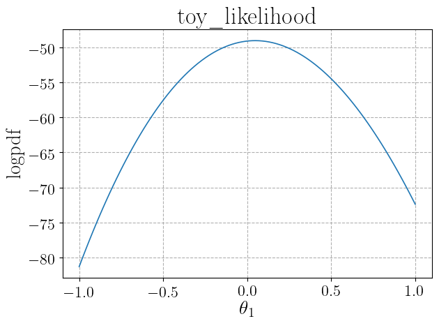
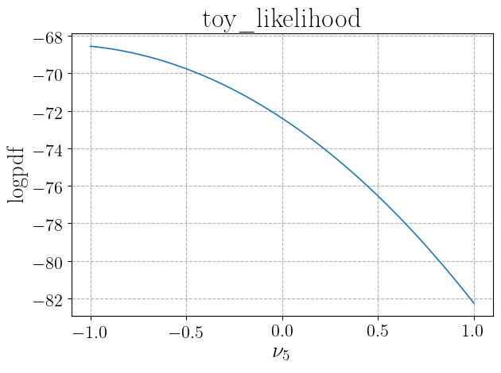

.. _likelihood_usage:

Usage
^^^^^

We give here a brief introduction to the use of the :class:`Lik <DNNLikelihood.Lik>` class. Refer to the 
full class documentation for more details.

The :class:`Lik <DNNLikelihood.Lik>` object can be created both by directly inputing the relevant arguments or
automatically,
in case the likelihood function comes from an ATLAS histfactory workspace, by the :class:`Histfactory <DNNLikelihood.Histfactory>` object 
through the :meth:`Histfactory.get_likelihood_object <DNNLikelihood.Histfactory.get_likelihood_object>` method. In the 
:ref:`the Histfactory object Usage <histfactory_usage>` section of the documentation we already gave an example of the latter method.
We give here a very simple (toy) example of creation of the object from direct input_json_file.

The first time a :class:`Lik <DNNLikelihood.Lik>` object is created, the :argument:`logpdf`, :argument:`logpdf_args` (
if required by :argument:`logpdf`), :argument:`logpdf_kwargs` (if required by :argument:`logpdf`), :argument:`pars_central`,
:argument:`pars_pos_nuis`, and :argument:`pars_pos_poi` arguments need to be specified. 
Optionally, also the arguments :argument:`pars_bounds` and :argument:`pars_labels` related to likelihood parameters can be specified.
Moreover, the user may specify the additional arguments
:argument:`output_folder` containing the path (either relative or absolute) to a folder where output files will be saved and
:argument:`name` with the name of the object (which is otherwise automatically generated).

To give a simple example, let us start by creating a very simple toy experiment with ``10`` bins, one nuisance parameter per 
bin and one signal strength parameter. The ``logpdf`` function could be defined by the cose:

.. code-block:: python

    import numpy as np

    nbI_nominal = np.array(list(reversed([i for i in range(100,1100,100)])))    # Nominal background
    nbI_obs = np.random.poisson(nbI_nominal)                                    # Observed counts
    nsI_reference = np.array(list(reversed([i for i in range(10,110,10)])))     # Signal prediction for signal strength mu=1

    def nbI(delta):
        # Background in each bin as function of the 10 nuisance parameters delta
        delta = np.array(delta)
        return np.array([nbI_nominal[i]*(1+0.1)**delta[i] for i in range(len(delta))])

    def nsI(mu):
        # Signal in each bin as function of the signal strength parameter mu
        return mu*nsI_reference

    def nI(pars):
        # Expected counts in each bin
        mu = pars[0]
        delta = pars[1:]
        return np.array(nsI(mu)+nbI(delta))

    def loglik(pars, obs):
        # Log of Poisson likelihood
        exp = nI(pars)
        logfact = np.array(list(map(lambda x: np.math.lgamma(x+1), obs)))
        return np.sum(-1*logfact+obs*np.log(exp)-exp)   

    def logprior(pars):
        # Log of normal distribution for deltas and uniform [-5,5] distribution for mu
        mu = pars[0]
        delta = pars[1:]
        delta_prior = -1/2*np.sum(delta**2+np.full(len(delta),np.log(2*np.pi)))
        return delta_prior-np.log(1/(10))
        
    def logpdf(pars, obs):
        # Sum of log-likelihood and log-prior
        return loglik(pars, obs)+logprior(pars)

This takes as arguments the parameters (mu, delta) and the observed counts. We can now define arguments related to 
parameters (we will not define labels, that will be automatically set by the object initialization)
and initialize the :class:`Lik <DNNLikelihood.Lik>` with a few lines of code:

.. code-block:: python

    import DNNLikelihood
    
    pars_pos_poi = [0]
    pars_pos_nuis = range(1,11)
    pars_central = np.insert(np.full(10,0),0,1)
    pars_labels = None,
    pars_bounds = np.concatenate((np.array([[-5,5]]),
                                  np.vstack([np.full(10,-np.inf),
                                             np.full(10,np.inf)]).T))

    likelihood = DNNLikelihood.Lik(name = 'toy',
                                          logpdf = logpdf,
                                          logpdf_args = [nbI_obs],
                                          pars_pos_poi = pars_pos_poi,
                                          pars_pos_nuis = pars_pos_nuis,
                                          pars_central = pars_central,
                                          pars_labels = None,
                                          pars_bounds = pars_bounds,
                                          output_folder = "<my_output_folder>")

When the object is created, it is automatically saved and two files are created:

   - <my_output_folder>/toy_likelihood.h5
   - <my_output_folder>/toy_likelihood.log

See the documentation of the :meth:`Lik.save <DNNLikelihood.Lik.save>` and 
:meth:`Lik.save_log <DNNLikelihood.Lik.save_log>` methods.

The object can also be initialized importing it from saved files. In this case only the :argument:`input_file` argument needs to be specified,
while all other arguments are ignored. One could also optionally specify a new :argument:`output_folder`. In case this is not specified, the 
:attr:`Lik.output_folder <DNNLikelihood.Lik.output_folder>` attribute from the imported object is used and the object is
saved overwriting existing files. If a new :argument:`output_folder` is specified, then the updated object is saved to the new location.
For instance we could import the object created above with

.. code-block:: python
    
   import DNNLikelihood

   likelihood = DNNLikelihood.Lik(input_file="<my_output_folder>/toy_likelihood")                

When the object is imported, the :attr:`Lik.log <DNNLikelihood.Lik.log>` 
attribute is updated and saved in the corresponding file :attr:`Lik.output_log_file <DNNLikelihood.Lik.output_log_file>`.

The logpdf for a given value of the parameters (for instance the 
:attr:`Lik.pars_central <DNNLikelihood.Lik.pars_central>`
can be obtained through

.. code-block:: python

    likelihood.logpdf_fn(likelihood.pars_central,*likelihood.logpdf_args)

We can check the logpdf depencence on the input parameters by plotting it with the method
:meth:`Lik.plot_logpdf_par <DNNLikelihood.Lik.plot_logpdf_par>`. For instance, one can get the plot
for the parameters ``0`` (signal strength) and ``5`` (nuisance parameter) in the range ``(-1,1)`` with all other
parameters set to their value in :attr:`Lik.pars_central <DNNLikelihood.Lik.pars_central>`, the plots can be
obtained through

.. code-block:: python

    likelihood.plot_logpdf_par([[0,-1,1],[5,-1,1]])

This prints the following plots in the active console

And saves two files, whose paths are stored in the :attr:`Lik.figures_list <DNNLikelihood.Lik.figures_list>`.
One could also optionally choose a different central value for the parameters that are kept fixed by passing an argument
``pars_init`` to the :meth:`Lik.plot_logpdf_par <DNNLikelihood.Lik.plot_logpdf_par>` method.

The maximum of the logpdf, and the corresponding parameters values can be obtained with the 
:meth:`Lik.compute_maximum_logpdf <DNNLikelihood.Lik.compute_maximum_logpdf>` and are stored in the 
:attr:`Lik.logpdf_max <DNNLikelihood.Lik.logpdf_max>` attribute:

.. code-block:: python

    likelihood.compute_maximum_logpdf()
    print(likelihood.logpdf_max["x"])
    print(likelihood.logpdf_max["y"])

    >>> [0.04380427  0.27652363  0.02134356 -0.15662528 -0.0267759  -0.30837557
         0.35269854 -0.36984361 -0.08494277 -0.13147428  0.52011438]
    >>> 47.26988825197074

Finally, one could profile the logpdf with respect to some of the parameters and compute local maxima through
the :meth:`Lik.compute_profiled_maxima <DNNLikelihood.Lik.compute_profiled_maxima>` method. This
is useful both to initialize chains in an MCMC or to perform profiled likelihood inference. The result is stored in the 
:attr:`Lik.logpdf_profiled_max <DNNLikelihood.Lik.logpdf_profiled_max>` attribute.
For instance, profiling with respect to the nuisance parameters for ``10`` values of the signal strength parameter
on a grid in the ``(-1,1)`` interval can be obtained as follows:

.. code-block:: python

    likelihood.compute_profiled_maxima(pars=[0],pars_ranges=[[-1,1,10]],spacing="grid",verbose=2)
    print(likelihood.logpdf_profiled_max["X"])
    print(likelihood.logpdf_profiled_max["Y"])

    >>> [[-1.          1.21169326  0.96592494  0.7891095   0.89669271  0.61408032
           1.21501547  0.49455945  0.71604701  0.58415075  1.07251509]
         [-0.77777778  1.01767165  0.76971591  0.59234143  0.7041785   0.42121161
           1.03431711  0.31223278  0.54606212  0.430467    0.95205154]
        ...]
    >>> [51.71637546558055 50.06649195316649 48.78240790167662 47.88015165741762
         47.37632133357318 47.28808819443674 47.63319733946957 48.429965264153346
         49.69727384417462 51.4545602580758]

The ``verbose=2`` argument allows to print a progress bar to monitor the evolution of the calculation of the maxima.
If one prefers to generate signal strength values randomly (with a flat distribution) instead that on a grid, the
argument ``spacing="random"`` can be passed.

Each of the above calls :class:`Lik <DNNLikelihood.Lik>` methods have updated the 
:attr:`Lik.log <DNNLikelihood.Lik.log>` attribute and the corresponding 
:attr:`Lik.output_log_file <DNNLikelihood.Lik.output_log_file>` file. 
Even though the files corresponding to the saved object are usually kept sync with the object state, manual change of some attributes
does not update them. Nevertheless, the full object can be saved at any time through

.. code-block:: python 

    likelihood.save(overwrite=True)

The ``overwrite=True`` ensure that the output files (generated when initializing the object) are updated.

Finally, we can save a likelihood script file that will be used to initialize a :class:`Sampler <DNNLikelihood.Sampler>` object
(see :ref:`the Sampler object <sampler_object>`) as

.. code-block:: python

    likelihood.save_script()

which produces the file <my_output_folder>/toy_likelihood_script.py.

.. include:: ../external_links.rst