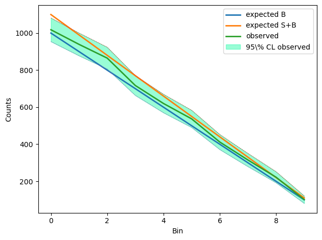

.. _likelihood_usage:

Usage
^^^^^

We give here a brief introduction to the use of the :class:`Lik <DNNLikelihood.Lik>` class. Refer to the 
full class documentation for more details.

The :class:`Lik <DNNLikelihood.Lik>` object can be created both by directly inputing the relevant 
arguments or automatically, in case the likelihood function comes from an ATLAS histfactory workspace, 
by the :class:`Histfactory <DNNLikelihood.Histfactory>` object through the 
:meth:`Histfactory.get_likelihood_object <DNNLikelihood.Histfactory.get_likelihood_object>` 
method. In the :ref:`the Histfactory object Usage <histfactory_usage>` section of the documentation 
we already gave an example of the latter method. We give here a very simple (toy) example of creation 
of the object from input arguments.

The first time a :class:`Lik <DNNLikelihood.Lik>` object is created, the following arguments need to 
be specified:

    - :argument:`logpdf <Lik.logpdf>`
    - :argument:`logpdf_args <Lik.logpdf_args>` (optional, if required by :argument:`logpdf <Lik.logpdf>`)
    - :argument:`logpdf_kwargs <Lik.logpdf_kwargs>` (optional, if required by :argument:`logpdf <Lik.logpdf>`)
    - :argument:`pars_central <Lik.pars_central>`
    - :argument:`pars_pos_nuis <Lik.pars_pos_nuis>`
    - :argument:`pars_pos_poi <Lik.pars_pos_poi>` 

If only one among the last two is specified, the other is determined from it by using the number of 
dimensions determined from the :argument:`logpdf <Lik.logpdf>` argument. Optionally, also the arguments 

    - :argument:`pars_bounds <Lik.pars_bounds>`
    - :argument:`pars_labels <Lik.pars_labels>`
    - :argument:`output_folder <Lik.output_folder>`
    - :argument:`name <Lik.name>`

can be specified. The first two correspond to Likelihood properties, the third contains the path 
(either relative relative to the code execution folder or absolute) to a folder where output files 
will be saved and the last is the name of the object (which is otherwise automatically generated).

To give a simple example, let us start by creating a very simple toy experiment with ``10`` bins, 
one nuisance parameter per bin and one signal strength parameter:

.. code-block:: python

    import numpy as np
    from matplotlib import pyplot as plt

    np.random.seed(1234)
    nbI_nominal = np.array(list(reversed([i for i in range(100,1100,100)])))
    nsI_reference = np.array(list(reversed([i for i in range(10,110,10)])))
    nbI_obs = np.random.poisson(nbI_nominal+1/2*nsI_reference)
    nbI_obs_up_2sigma = nbI_obs+2*np.sqrt(nbI_obs)
    nbI_obs_down_2sigma = nbI_obs-2*np.sqrt(nbI_obs)

A graphical representation of this toy experiment can be obtained through:

.. code-block:: python

    x=range(10)
    plt.plot(x,nbI_nominal,label="expected B",linewidth=2)
    plt.plot(x,nbI_nominal+nsI_reference,label="expected S+B",linewidth=2)
    plt.plot(x,nbI_obs,label="observed",linewidth=2)
    plt.plot(x,nbI_obs_up_2sigma,"--",linewidth=0.5,label=None)
    plt.plot(x,nbI_obs_down_2sigma,"--",linewidth=0.5,label=None)
    plt.fill_between(x, 
                     nbI_obs_up_2sigma, 
                     nbI_obs_down_2sigma,
                     color="mediumspringgreen",
                     label=r"95\% CL observed",
                     alpha=0.4)
    plt.legend()
    plt.xlabel("Bin")
    plt.ylabel("Counts")
    plt.tight_layout()
    plt.show()
    plt.close()

This prints the following plots in the active console

The ``logpdf`` function can be defined as:

.. code-block:: python

    def nbI(delta):
        # Background in each bin as function of the 10 nuisance parameters delta
        delta = np.array(delta)
        return np.array([nbI_nominal[i]*(1+0.1)**delta[i] for i in range(len(delta))])

    def nsI(mu):
        # Signal in each bin as function of the signal strength parameter mu
        return mu*nsI_reference

    def nI(pars):
        # Expected counts in each bin
        mu = pars[0]
        delta = pars[1:]
        return np.array(nsI(mu)+nbI(delta))

    def loglik(pars, obs):
        # Log of Poisson likelihood
        exp = nI(pars)
        logfact = np.array(list(map(lambda x: np.math.lgamma(x+1), obs)))
        return np.sum(-1*logfact+obs*np.log(exp)-exp)   

    def logprior(pars):
        # Log of prior: normal distribution for deltas and uniform [-5,5] distribution for mu
        mu = pars[0]
        delta = pars[1:]
        delta_prior = -1/2*np.sum(delta**2+np.full(len(delta),np.log(2*np.pi)))
        return delta_prior-np.log(1/(10))
        
    def logpdf(pars, obs):
        # Logpdf given by the sum of log-likelihood and log-prior
        return loglik(pars, obs)+logprior(pars)

This function takes as arguments the parameters (mu, **delta**) and the observed counts. 
In this example we will define the Likelihood object from the log-pdf and not from the log-Likelihood
itself. The difference is only given by the log-prior, which can be added and subtracted at any time.
We can now define arguments related to parameters (if labels are not defined, then they will be 
automatically generated) and initialize the :class:`Lik <DNNLikelihood.Lik>` with a few lines of code:

.. code-block:: python

    import DNNLikelihood
    
    pars_pos_poi = [0]
    pars_pos_nuis = range(1,11)
    pars_central= np.insert(np.full(len(pars_pos_nuis),0),pars_pos_poi,0)
    pars_bounds = np.concatenate((np.array([[-5,5]]),
                                  np.vstack([np.full(10,-np.inf),
                                             np.full(10,np.inf)]).T))
    pars_labels = [r"$\mu$"]
    for i in range(len(pars_pos_nuis)):
        pars_labels.append(r"$\nu_{%d}$" % i)

    likelihood = DNNLikelihood.Lik(name = 'toy',
                                   logpdf = logpdf,
                                   logpdf_args = [nbI_obs],
                                   pars_central = pars_central,
                                   pars_pos_poi = pars_pos_poi,
                                   pars_pos_nuis = pars_pos_nuis,
                                   pars_labels = pars_labels,
                                   pars_bounds = pars_bounds,
                                   output_folder = "<path_to_output_folder>")

    >>> ============================== 
        Initialize Likelihood object.

        ============================== 
        Lik output folder set to
        	 <abs_path_to_output_folder> .

        ============================== 
        Likelihood json file
        	 <abs_path_to_output_folder>\toy_likelihood.json 
        saved in 0.0018376000000017711 s.

        ============================== 
        Likelihood h5 file
        	 <abs_path_to_output_folder>\toy_likelihood.h5 
        saved in 0.015376500000002125 s.

        ============================== 
        Predictions json file
        	 <abs_path_to_output_folder>\toy_likelihood_predictions.json 
        saved in 0.0016533000000009679 s.

        ============================== 
        Likelihood log file
        	 <abs_path_to_output_folder>\toy_likelihood.log 
        saved in 0.0009189000000020542 s.

where we used the placeholders <path_to_output_folder>, and 
<abs_path_to_output_folder> to indicate the corresponding paths 
(relative paths can be given as input and are automatically converted into absolute paths).

When the object is created, it is automatically saved and four files are created:

    - <abs_path_to_output_folder>/toy_likelihood.h5
    - <abs_path_to_output_folder>/toy_likelihood.json
    - <abs_path_to_output_folder>/toy_likelihood.log
    - <abs_path_to_output_folder>/toy_likelihood_predictions.json 

See the documentation of the 

    - :meth:`Lik.save <DNNLikelihood.Lik.save>`
    - :meth:`Lik.save_h5 <DNNLikelihood.Lik.save_h5>`
    - :meth:`Lik.save_json <DNNLikelihood.Lik.save_json>`
    - :meth:`Lik.save_log <DNNLikelihood.Lik.save_log>`
    - :meth:`Lik.save_predictions_json <DNNLikelihood.Lik.save_predictions_json>`

methods for more details.

The object can also be initialized importing it from saved files. In this case only the 
:argument:`input_file <Lik.input_file>` argument needs to be specified (with path relative 
to the code execution folder or absolute and with or without extension), while all other arguments 
are ignored. One could also optionally specify a new :argument:`output_folder <Lik.output_folder>`. 
In case this is not specified, the :attr:`Lik.output_folder <DNNLikelihood.Lik.output_folder>` 
attribute is set equal to the :attr:`Lik.input_folder <DNNLikelihood.Lik.input_folder>` one, so that the 
object continues to be saved in the same path from which it has been imported.
For instance we could import the object created above with

.. code-block:: python
    
   import DNNLikelihood

   likelihood_loaded = DNNLikelihood.Lik(input_file="<path_to_output_folder>/toy_likelihood")      

    >>> ============================== 
        Initialize Likelihood object.

        ============================== 
        Likelihood object loaded in 0.010173800000018218 .

        ============================== 
        Lik output folder set to
        	 <abs_path_to_output_folder> .

        ============================== 
        Predictions json file
        	 <abs_path_to_output_folder>\toy_likelihood_predictions.json 
        updated (or saved if it did not exist) in 0.0010424000000028855 s.

        ============================== 
        Likelihood log file
        	 <abs_path_to_output_folder>\toy_likelihood.log 
        updated (or saved if it did not exist) in 0.0011185999999838714 s.

When the :class:`Lik <DNNLikelihood.Lik>` object is created, the :argument:`logpdf <Lik.logpdf>` 
input argument is saved in a FunctionWrapper together with the optional 
:argument:`logpdf_args <Lik.logpdf_args>` and :argument:`logpdf_kwargs <Lik.logpdf_kwargs>`
arguments. The numerical value of the lofpdf for a given value of the parameters (for instance the 
:attr:`Lik.pars_central <DNNLikelihood.Lik.pars_central>`) can be obtained through

.. code-block:: python

    likelihood.logpdf(likelihood.pars_central)

    >>> -54.736235046924904

The value of the optional :argument:`logpdf_args <Lik.logpdf_args>` and 
:argument:`logpdf_kwargs <Lik.logpdf_kwargs>` arguemnts, together with the function provided by the 
:argument:`logpdf <Lik.logpdf>` argument, can be extracted from the FunctionWrapper as follows:

.. code-block:: python

    print(likelihood.logpdf.f)
    print(likelihood.logpdf.args)
    print(likelihood.logpdf.kwargs)

    >>> <function logpdf at 0x7fc0a7a54550>
        [array([1018,  939,  865,  717,  620,  537,  412,  315,  222,  101])]
        {}

A general logpdf function is given by the :meth:`Lik.logpdf_fn <DNNLikelihood.Lik.logpdf_fn>` method, 
which takes both the function and the optional arguments as inputs. For instance, one could use it to
calclulate the logpdf for different values of ``args`` (in this case a list containing an array with 
the observed counts) and ``kwargs`` (in this case an empty dictionary) through

.. code-block:: python

    likelihood.logpdf_fn(likelihood.pars_central,*[np.array([1031,  903,  810,  720,  597,  477,  421,  304,  211,  104])],**{})

    >>> -49.754671664827484

where we explicitly added an empty optional ``kwargs`` for illustration purposes. 
In particular, notice the equivalence of the two members in the following code:

.. code-block:: python

    likelihood.logpdf(likelihood.pars_central)==likelihood.logpdf_fn(likelihood.pars_central,*likelihood.logpdf.args,**likelihood.logpdf.kwargs)

    >>> True

Results computed with the various methods of the object are saved in the 
:attr:`Lik.predictions <DNNLikelihood.Lik.predictions>` dictionary attribute, which is saved into the 
output json file corresponding to the 
:attr:`Lik.output_predictions_json_file <DNNLikelihood.Lik.output_predictions_json_file>` attribute 
through the :meth:`Lik.save_predictions_json <DNNLikelihood.Lik.save_predictions_json>` method.
The :attr:`Lik.predictions <DNNLikelihood.Lik.predictions>` dictionary also stores,
under the item corresponding to the key ``"Figures"``, information on the
generated figures. The :attr:`Lik.predictions <DNNLikelihood.Lik.predictions>` dictionary 
can be reset at any time as follows:

.. code-block:: python

    likelihood.reset_predictions(delete_figures=True,save=True,verbose=2)

    >>> ============================== 
        Resetting predictions.

        ============================== 
        All predictions and figures have been deleted and the 'predictions' attribute has been initialized.

        ============================== 
        Predictions json file
        	 <abs_path_to_output_folder>\toy_likelihood_predictions.json 
        updated (or saved if it did not exist) in 0.000885500000002537 s.

        ============================== 
        Likelihood log file
        	 <abs_path_to_output_folder>\toy_likelihood.log 
        updated (or saved if it did not exist) in 0.001010800000003087 s.

        ============================== 
        Predictions reset in 0.0007486999999954946 s.

One can check the logpdf dependence on the input parameters by plotting it with the 
:meth:`Lik.plot_logpdf_par <DNNLikelihood.Lik.plot_logpdf_par>` method. For instance, one can get 
the plot for the parameters ``0`` (signal strength) and ``5`` (nuisance parameter) in the range 
``(-1,1)`` with all other parameters set to their central values (i.e. their values defined in the 
:attr:`Lik.pars_central <DNNLikelihood.Lik.pars_central>` attribute), through

.. code-block:: python

    likelihood.plot_logpdf_par([[0,-1,1],[5,-1,1]],show_plot=True,overwrite=True,verbose=2)

    >>> ============================== 
        Making plot of logpdf as function of paramerers.

        ============================== 
        Checking and updating figures dictionary

        <plot1>

        ==============================
        Figure file
        	 <abs_path_to_output_folder>/figures/toy_likelihood_figure_par_0.pdf 
        created and saved in 8.517387338011758 s.

        ============================== 
        Checking and updating figures dictionary

        <plot2>

        ==============================
        Figure file
        	 <abs_path_to_output_folder>/figures/toy_likelihood_figure_par_5.pdf 
        created and saved in 3.949587409006199 s.

        ============================== 
        Predictions json file
        	 <abs_path_to_output_folder>\toy_likelihood_predictions.json 
        updated (or saved if it did not exist) in 0.0014017000000023927 s.

        ============================== 
        Likelihood log file
        	 <abs_path_to_output_folder>/toy_likelihood.log 
        updated (or saved if it did not exist) in 0.0035943260008934885 s.

The plots <plot1> and <plot2> printed on the active console are

.. image:: ../figs/toy_likelihood_figure_par_0.png
    :class: with-shadow
    :scale: 54

and are saved to two files, whose names are stored in the ``"Figures"`` item of the
:attr:`Lik.predictions <DNNLikelihood.Lik.predictions>` dictionary attribute (under a corresponding
timestamp item):

.. code-block:: python

    likelihood.predictions["Figures"]

    >>> {<timestamp>: ['toy_likelihood_figure_par_0.pdf',
        'toy_likelihood_figure_par_5.pdf']}

where <timestamp> is a string of the form "datetime_aaaa_mm_dd_hh_mm_ss_xxxx" containing the 
corresponding timestamp.
Figures are saved in the folder given by the 
:attr:`Lik.output_figures_folder <DNNLikelihood.Lik.output_figures_folder>` attribute.
One could also optionally choose a different central value for the parameters that are kept fixed 
by passing an argument ``pars_init`` to the 
:meth:`Lik.plot_logpdf_par <DNNLikelihood.Lik.plot_logpdf_par>` method.

The maximum of the logpdf, and the corresponding parameters values can be obtained with the 
:meth:`Lik.compute_maximum_logpdf <DNNLikelihood.Lik.compute_maximum_logpdf>` method 
and are stored in the item corresponding to the ``"logpdf_max"`` key of the 
:attr:`Lik.predictions <DNNLikelihood.Lik.predictions>` dictionary:

.. code-block:: python

    likelihood.compute_maximum_logpdf(pars_init=None,
                                      pars_bounds=None,
                                      optimizer={"name": "scipy",
                                                 "args": [],
                                                 "kwargs": {"method": "Powell"}},
                                      minimization_options={"maxiter": 100000,
                                                            "ftol": 0.000001},
                                      timestamp=None,
                                      save=True,
                                      overwrite=True,
                                      verbose=2)
    likelihood.predictions["logpdf_max"]

    >>> ============================== 
        Computing global maximum
        Maximum logpdf computed in 0.28266679999978805 s.

        ============================== 
        Predictions json file
        	 <abs_path_to_output_folder>\toy_likelihood_predictions.json 
        updated (or saved if it did not exist) in 0.0014535000009345822 s.

        ============================== 
        Likelihood log file
        	 <abs_path_to_output_folder>\toy_likelihood.log 
        updated (or saved if it did not exist) in 0.0012204000013298355 s.

        {<timestamp>: {'x': array([ 0.28835589 , 0.         , 0.13434444 , -0.43674865, 0.         , 
                                    0.03920713 , -0.35602373, 0.00895953 , 0.16032245 , -0.51686047, 
                                    0.        ]),
                       'y': -48.06194074972852,
                       'pars_init': array([0, 0, 0, 0, 0, 0, 0, 0, 0, 0, 0]),
                       'pars_bounds': array([[ -5.,   5.],
                                             [-inf,  inf],
                                             ...
                                             [-inf,  inf]]),
                       'optimizer': {'name': 'scipy', 'args': [], 'kwargs': {'method': 'Powell'}},
                       'minimization_options': {'maxiter': 100000, 'ftol': 1e-06},
                       'optimization_time': 0.2501852900022641}}

One could also profile the logpdf with respect to some of the parameters and compute local maxima 
through the :meth:`Lik.compute_profiled_maxima_logpdf <DNNLikelihood.Lik.compute_profiled_maxima_logpdf>` 
method. This is useful both to initialize chains in a MCMC or to perform profiled likelihood inference. 
The result is stored in the item corresponding to the "logpdf_profiled_max" key of the 
:attr:`Lik.predictions <DNNLikelihood.Lik.predictions>` dictionary.
For instance, profiling with respect to all the nuisance parameters for ``10`` values of the 
signal strength parameter on a grid in the ``(-1,1)`` interval, one obtains:

.. code-block:: python

    likelihood.compute_profiled_maxima_logpdf(pars=[0],
                                              pars_ranges=[[-1,1,50]],
                                              pars_init=None,
                                              pars_bounds=None,
                                              spacing="grid",
                                              optimizer={"name": "scipy",
                                                         "args": [],
                                                         "kwargs": {"method": "Powell"}},
                                              minimization_options={"maxiter": 10000,
                                                                    "ftol": 0.0001},
                                              progressbar=True,
                                              timestamp=None,
                                              save=True,
                                              overwrite=True,
                                              verbose=2)
    print(likelihood.predictions["logpdf_max"])
    print(likelihood.predictions["logpdf_profiled_max"])

    >>> ============================== 
        Computing profiled maxima

        <progress_bar>

        The key <timestamp> was not specified and has been set to the default value '{}'.
        Total number of points: 50 .
        Optimizing for parameters: [0]  - values: [-1.0] .
        ...
        Optimizing for parameters: [0]  - values: [1.0] .
        Computing global maximum to estimate tmu test statistics.
        
        ============================== 
        Predictions json file
        	 <abs_path_to_output_folder>\toy_likelihood_predictions.json 
        updated (or saved if it did not exist) in 0.005493800001204363 s.
        
        ============================== 
        Likelihood log file
        	 <abs_path_to_output_folder>\toy_likelihood.log 
        updated (or saved if it did not exist) in 0.001368900000670692 s.
        
        ============================== 
        50 local maxima computed in 5.734996799999863 s.
        Log-pdf values lie in the range [ -57.07828497740044 , -48.09221672868154 ].

        {<timestamp1>: {'x': array([ 0.28835589,  0.        ,  0.13434444, -0.43674865,  0.        ,
                                     0.03920713, -0.35602373,  0.00895953,  0.16032245, -0.51686047,
                                     0.        ]), 
                        'y': -48.06194074972852, 
                        'pars_init': array([0, 0, 0, 0, 0, 0, 0, 0, 0, 0, 0]),
                        'pars_bounds': array([[ -5.,   5.],
                                              [-inf,  inf],
                                              ...
                                              [-inf,  inf]]),
                        'optimizer': {'name': 'scipy', 'args': [], 'kwargs': {'method': 'Powell'}}, 
                        'minimization_options': {'maxiter': 100000, 'ftol': 1e-06}, 
                        'optimization_time': 0.2501852900022641}, 
         <timestamp2>: {'x': array([ 0.28903846,  0.        ,  0.13370308, -0.43622569,  0.        ,
                                     0.03690392, -0.35563725,  0.00608195,  0.15979295, -0.51643255,
                                     0.        ]), 
                        'y': -48.06198053689947, 
                        'pars_init': array([0, 0, 0, 0, 0, 0, 0, 0, 0, 0, 0]),
                        'pars_bounds': array([[ -5.,   5.],
                                              [-inf,  inf],
                                              ...
                                              [-inf,  inf]]),
                        'optimizer': {'name': 'scipy', 'args': [], 'kwargs': {'method': 'Powell'}}, 
                        'minimization_options': {}, 
                        'optimization_time': 0.16715143001056276}}
        {<timestamp2>: {'X': array([[-1.00000000e+00,  1.07368376e+00,  1.27984277e+00,
                                      1.57830130e+00,  1.08953930e+00,  1.14335977e+00,
                                      1.43461139e+00,  1.04765467e+00,  1.13227833e+00,
                                      1.40150676e+00,  5.70153228e-01],
                                      ...
                                    [ 1.00000000e+00,  0.00000000e+00,  0.00000000e+00,
                                      0.00000000e+00,  0.00000000e+00,  0.00000000e+00,
                                      0.00000000e+00,  0.00000000e+00,  0.00000000e+00,
                                      6.55629299e-02,  0.00000000e+00]]), 
                        'Y': array([-56.336064718100715, -55.893978669360074, -55.4627652463664,
                                    ...
                                    -55.98431131656419, -57.07828497740044], dtype=object), 
                        'tmu': array([[-1.        , 16.54816836],
                                      ...
                                      [ 1.        , 18.03260888]]), 
                        'pars': [0], 
                        'pars_ranges': [[-1, 1, 50]], 
                        'pars_init': array([0, 0, 0, 0, 0, 0, 0, 0, 0, 0, 0]), 
                        'pars_bounds': array([[ -5.,   5.],
                                              [-inf,  inf],
                                              ...
                                              [-inf,  inf]]),
                        'optimizer': {'name': 'scipy', 'args': [], 'kwargs': {'method': 'Powell'}}, 
                        'minimization_options': {'maxiter': 10000, 'ftol': 0.0001}, 
                        'optimization_times': [0.040598378982394934, 0.041676215012557805, 
                                               ...
                                               0.12507603599806316, 0.060885928018251434], 
                        'total_optimization_time': 3.9257324769569095}}

The ``progressbar=True`` argument allows one to print a progress bar to monitor the evolution of the 
calculation of the maxima. If one prefers to scan randomly (with a flat distribution) with respect 
to using an evenly spaced grid, the argument ``spacing="random"`` can be passed. 
For additional functionality of the 
:meth:`Lik.compute_profiled_maxima_logpdf <DNNLikelihood.Lik.compute_profiled_maxima_logpdf>` method, 
such as the choice of the ``scipy.optimize`` optimizer, refer to the method documentation.
Finally notice that the 
:meth:`Lik.compute_profiled_maxima_logpdf <DNNLikelihood.Lik.compute_profiled_maxima_logpdf>` method
also calls the :meth:`Lik.compute_maximum_logpdf <DNNLikelihood.Lik.compute_maximum_logpdf>` method 
to computes the global maximum with the same optimizer and timestamp (<timestamp2> in the example
above), used to compute a :math:`t_{\\mu}` test statistics. As shown in the code above,
the latter is saved in the ``"tmu"`` item as a list of pairs with parameters in the first column 
and :math:`t_{\\mu}` values in the second one.

The computed values of :math:`t_{\\mu}` can be plotted with the 
:meth:`Lik.plot_tmu_1d <DNNLikelihood.Lik.plot_tmu_1d>` method as follows:

.. code-block:: python

    timestamp_tmu=list(likelihood.predictions["logpdf_profiled_max"].keys())[-1]
    likelihood.plot_tmu_1d(timestamp_tmu=timestamp_tmu,
                           pars_labels="original",
                           title_fontsize=12,
                           timestamp=None,
                           show_plot=True,
                           overwrite="dump",
                           verbose=2)

    >>> ============================== 
        Making plot of t_mu test statistics as function of paramerers

        ============================== 
        Checking and updating figures dictionary

        <plot3>

        ==============================
        Figure file
        	 <abs_path_to_output_folder>/figures/dump_toy_likelihood_figure_tmu_0_datetime_2022_01_24_10_41_08_2717.pdf 
        created and saved in 3.554831576999277 s.

        ============================== 
        Predictions json file
            <abs_path_to_output_folder>\toy_likelihood_predictions.json 
        updated (or saved if it did not exist) in 0.006060300000001462 s.

        ============================== 
        Likelihood log file
            <abs_path_to_output_folder>\toy_likelihood.log 
        updated (or saved if it did not exist) in 0.0011037999999530257 s.

where <plot3> is given by

The figure is also saved in the corresponding file, whose name is addded to the ``"Figures"`` item of the
:attr:`Lik.predictions <DNNLikelihood.Lik.predictions>` attribute:

.. code-block:: python

    likelihood.predictions["Figures"]

    >>> {<timestamp1>: ['toy_likelihood_figure_par_0.pdf',
                        'toy_likelihood_figure_par_5.pdf'],
         <timestamp2>: ['toy_likelihood_figure_tmu_0.pdf']}

Finally, one can save a likelihood script file that can be used to initialize a 
:class:`Sampler <DNNLikelihood.Sampler>` object (see :ref:`the Sampler object <sampler_object>`) as

.. code-block:: python

    timestamp=list(likelihood.predictions["logpdf_profiled_max"].keys())[-1]
    likelihood.save_script(timestamp=timestamp,overwrite=True)

    >>> ============================== 
        Likelihood log file
        	 <abs_path_to_output_folder>\toy_likelihood.log 
        updated (or saved if it did not exist) in 0.0012540999999828273 s.

        ============================== 
        Likelihood script file
        	 <abs_path_to_output_folder>\toy_likelihood_script.py 
        updated (or saved if it did not exist) in 0.0010519999999587526 s.

which produces the file <abs_path_to_output_folder>/toy_likelihood_script.py. By providing the ``timestamp``
argument, one ensures that the chains in the :class:`Sampler <DNNLikelihood.Sampler>` are initialized
using the profiled maxima saved in the ``likelihood.predictions["logpdf_profiled_max"][timestamp]``
item.

Each of the above calls to :class:`Lik <DNNLikelihood.Lik>` methods updates the 
:attr:`Lik.log <DNNLikelihood.Lik.log>` attribute and the corresponding
:attr:`Lik.output_log_file <DNNLikelihood.Lik.output_log_file>` file (that stores a log of the 
:class:`Lik <DNNLikelihood.Lik>` object). Moreover, any method that modifies the 
:attr:`Lik.predictions <DNNLikelihood.Lik.predictions>` attribute, updates by default (through the
default argument ``save=True`` and ``overwrite=True``) the 
:attr:`Lik.output_predictions_json_file <DNNLikelihood.Lik.output_predictions_json_file>` file.
Even though the files corresponding to the saved object 
are usually kept sync with the object state, manual change of some attributes does not update them. 
Nevertheless, the full object can be saved at any time through

.. code-block:: python 

    likelihood.save(overwrite=True)

    >>> ============================== 
        Likelihood json file
        	 <abs_path_to_output_folder>\toy_likelihood.json 
        updated (or saved if it did not exist) in 0.005770800000050258 s.

        ============================== 
        Likelihood h5 file
        	 <abs_path_to_output_folder>\toy_likelihood.h5 
        updated (or saved if it did not exist) in 0.036816899999962516 s.

        ============================== 
        Predictions json file
        	 <abs_path_to_output_folder>\toy_likelihood_predictions.json 
        updated (or saved if it did not exist) in 0.005177099999968959 s.

        ============================== 
        Likelihood log file
        	 <abs_path_to_output_folder>\toy_likelihood.log 
        updated (or saved if it did not exist) in 0.001476699999898301 s.

The ``overwrite=True`` ensure that the output files are updated. 
If one aims at saving the object to new files, the ``overwrite=False`` argument should be passed.
Finally, one can make a full "dump" of the object, without modifying its current state and output files
with the ``overwrite="dump"`` option.

.. include:: ../external_links.rst