.. _sampler_usage:

Usage
^^^^^

We give here a brief introduction to the use of the :class:`Sampler <DNNLikelihood.Sampler>` class. Refer to the 
full class documentation for more details. All examples will be referred to the toy likelihood introduced in 
the
:mod:`Likelihood <likelihood>` object :ref:`Usage <likelihood_usage>` section of the documentation.

The :class:`Sampler <DNNLikelihood.Sampler>` class has been thought to be as flexible as possible in terms of initialization
and input parameters. Indeed the object can be initialized by passing different combinations of arguments and the 
:meth:`Sampler.__init__ <DNNLikelihood.Sampler.__init__>` method always extracts (or creates if it does not exist) the file
corresponding to the :attr:`Sampler.likelihood_script_file <DNNLikelihood.Sampler.likelihood_script_file>` attribute.
The likelihood related parameters and the logpdf are always set by importing this file as a module, which instantiates a
:class:`Lik <DNNLikelihood.Lik>` object, and defines parameters from it.

The procedure of passing the :class:`Lik <DNNLikelihood.Lik>` object through a script file instead of 
passing it directly may seem redundant. However, this is needed to ensure that MCMC properly runs in parallel also on
Windows machines, where the |multiprocessing_link| package may have unexpected behavior.

When the input argument :argument:`input_file <Sampler.input_file>` is ``None`` (default) a new 
:class:`Sampler <DNNLikelihood.Sampler>` object is created. 
One can proceed in two different ways, by giving as input one of the two arguments
:argument:`likelihood_script_file <Sampler.likelihood_script_file>` or :argument:`likelihood <Sampler.likelihood>`. 
Any of these arguments can be used to determine the attribute 
:attr:`Sampler.likelihood_script_file <DNNLikelihood.Sampler.likelihood_script_file>`
which is then used to import the likelihood related attributes. If both these arguments are specified, then priority is
given to :argument:`likelihood_script_file <Sampler.likelihood_script_file>`. 
The code corresponding to these two options is:

    - Initialization from :argument:`likelihood_script_file <Sampler.likelihood_script_file>`

        This assumes that a likelihood script file has been already created (see then :ref:`the Likelihood object Usage <likelihood_usage>` 
        section of the documentation). The :class:`Sampler <DNNLikelihood.Sampler>` can then be initialized as

        .. code-block:: python

            import DNNLikelihood

            sampler = DNNLikelihood.Sampler(likelihood_script_file=<my_output_folder>/toy_likelihood_script,
                                            nsteps_required=50000)
                                            
        This initializes the object with a required number of steps ``nsteps_required=50000`` (this could then be changed to run for more steps). 
        We have not passed a ``move_str`` input so that the default |emcee_link| move ``emcee.moves.StretchMove()`` will be set (see the 
        :attr:`Sampler.move_str <DNNLikelihood.Sampler.move_str>` attribute documentation for more details). Moreover, since 
        ``parallel_CPU`` has not been specified, the attribute :attr:`Sampler.parallel_CPU <DNNLikelihood.Sampler.parallel_CPU>` 
        is automatically set to ``True`` and the sampler will be running in parallel mode.

        When the object is created, it is automatically saved and three files are created:

            - <my_output_folder>/toy_sampler.h5
            - <my_output_folder>/toy_sampler.log 
            - <my_output_folder>/toy_sampler_backend.h5

    - Initialization from :argument:`likelihood <Sampler.likelihood>`

        The exact same object as above could be initialized directly from a :class:`Lik <DNNLikelihood.Lik>` object. In this case the
        :meth:`Sampler.__init__ <DNNLikelihood.Sampler.__init__>` method takes care of generating the script file 
        (and storing it in the :attr:`Sampler.likelihood_script_file <DNNLikelihood.Sampler.likelihood_script_file>` folder):

        .. code-block:: python

            import DNNLikelihood

            likelihood = DNNLikelihood.Lik(input_file="<my_output_folder>/toy_likelihood")

            sampler = DNNLikelihood.Sampler(likelihood=likelihood,
                                            nsteps_required=50000)

In one is interested in importing a previously saved :class:`Sampler <DNNLikelihood.Sampler>`, instead of generating a new one, then the input 
argument :argument:`input_file <Sampler.input_file>` should be specified. The 
:argument:`input_file <Sampler.input_file>`, 
:argument:`likelihood_script_file <Sampler.likelihood_script_file>` are set from this argument and the object is loaded. Obviously, 
the files corresponding to :attr:`Sampler.input_file <DNNLikelihood.Sampler.input_file>` 
should exist (i.e. a saved :class:`Sampler <DNNLikelihood.Sampler>` object should be available). 

The following code shows how to import a previously saved object:

    .. code-block:: python

        import DNNLikelihood

        sampler = DNNLikelihood.Sampler(new_sampler=False,
                                        input_file=<my_output_folder>/toy_sampler)

When the object is imported, the :attr:`Sampler.log <DNNLikelihood.Sampler.log>` attribute is updated, as well as the corresponding file
<my_output_folder>/toy_sampler.log. If a new ``nsteps_required`` input, larger than the number of steps available in the existing backend is passed,
then this is saved in the :attr:`Sampler.nsteps_required <DNNLikelihood.Sampler.nsteps_required>`, which is otherwise set to the number of available steps.
Also the ``moves_str`` input can be passed to update (change) the move of the sampler.

Now that we have discussed how to create and import the object, let us see how to use it. The first thing the object is used for is
sampling. Onee can produce a sampling as follows:

.. code-block:: python

    sampler.run_sampler(verbose=2)

This runs the sampler and, through the ``verbose=2`` argument, shows a progress bar, together with the remaining time. Since the object
has attribute :attr:`Sampler.parallel_CPU <DNNLikelihood.Sampler.parallel_CPU>` set to ``True`` the sampling is run in n parallel
processes, with n equal to the number of physical (not logical) cores. While the sampler runs, all produced sampler are saved in real
time in the backend file corresponding to the :attr:`Sampler.backend_file <DNNLikelihood.Sampler.backend_file>`
attribute. At the end of the sampling also the log attribute and file are updated. 
The :attr:`Sampler.sampler <DNNLikelihood.Sampler.sampler>` and :attr:`Sampler.backend <DNNLikelihood.Sampler.backend>` correspond to the
|emcee_link| objects |emcee_ensemble_sampler_link| and |emcee_backend_link| and we refer to the |emcee_link| documentation for their use.
Nevertheless, the :class:`Sampler <DNNLikelihood.Sampler>` object, includes several methods that allow to perform convergence studies,
produce plots, and extract samples without the need of directly digging into the |emcee_link| objects and documentation.

One can for instance compute the Gelman and Rubin metrics :cite:`Gelman:1992zz` for some parameters using the 
:meth:`Sampler.plot_gelman_rubin <DNNLikelihood.Sampler.plot_gelman_rubin>` method. As an example we show below the metrics 
for parameters ``0`` (poi) and ``5`` (nuis) after ``[500,1000,5000,10000,50000]`` steps:

.. code-block:: python

    sampler.gelman_rubin(pars=[0,5],nsteps=[500,1000,5000,10000,50000])

    >>> array([[0.00000000e+00, 5.00000000e+02, 1.09139684e+00, 2.47454986e-01, 2.08260547e-01],
               [0.00000000e+00, 1.00000000e+03, 1.05672208e+00, 1.84330055e-01, 1.65349725e-01],
               [0.00000000e+00, 5.00000000e+03, 1.01555635e+00, 1.26862627e-01, 1.23053024e-01],
               [0.00000000e+00, 1.00000000e+04, 1.00790794e+00, 1.20567487e-01, 1.18705125e-01],
               [0.00000000e+00, 5.00000000e+04, 1.00124959e+00, 1.15572381e-01, 1.15290829e-01],
               [5.00000000e+00, 5.00000000e+02, 1.13686644e+00, 3.49600912e-01, 2.71401392e-01],
               [5.00000000e+00, 1.00000000e+03, 1.06837042e+00, 3.03575872e-01, 2.66503447e-01],
               [5.00000000e+00, 5.00000000e+03, 1.01267127e+00, 2.61092073e-01, 2.54676062e-01],
               [5.00000000e+00, 1.00000000e+04, 1.00587726e+00, 2.62245501e-01, 2.59235550e-01],
               [5.00000000e+00, 5.00000000e+04, 1.00122323e+00, 2.56878972e-01, 2.56262912e-01]])

This returns an array with the value of the parameter in the first column, the number of steps in the second and
the values of the metrics in the third to fifth (see the documentation of the :meth:`Sampler.gelman_rubin <DNNLikelihood.Sampler.gelman_rubin>` method for
details on the metrics and additional options).

One could also produce plots of these metrics using the :meth:`Sampler.plot_gelman_rubin <DNNLikelihood.Sampler.plot_gelman_rubin>`
method:

.. code-block:: python

    sampler.plot_gelman_rubin(pars=[0,5], npoints=10)

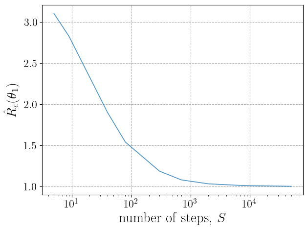

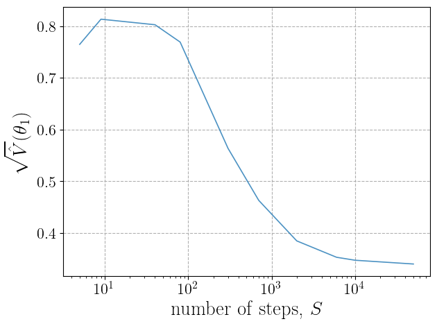

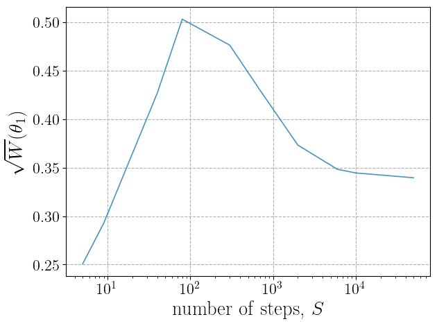

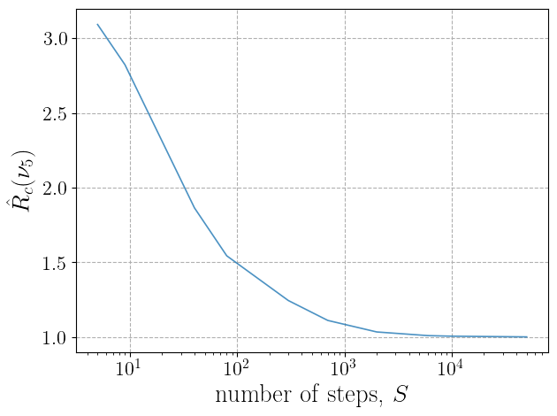

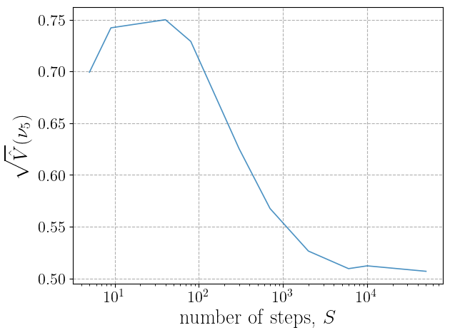

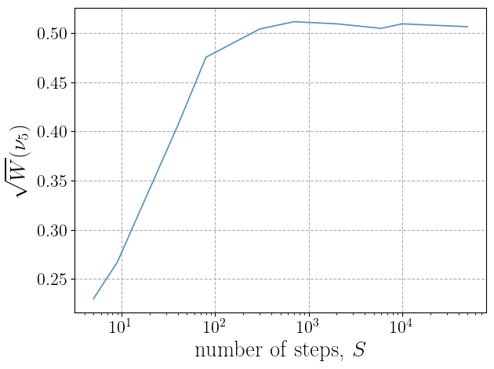

Convergence could also be monitored through the autocorrelation time, which could be plot using the 
:meth:`Sampler.plot_autocorr <DNNLikelihood.Sampler.plot_autocorr>`. See the method documentation for details on the various
algorithms and options. For instance, using all available methods plots for parameters ``0`` and ``5`` can be produces
as follows:

.. code-block:: python

    sampler.plot_autocorr(pars=[0,5])

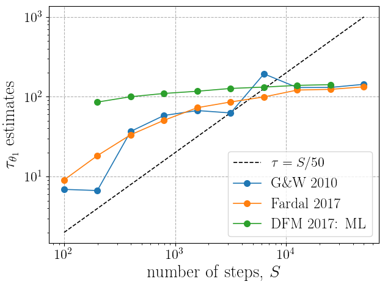

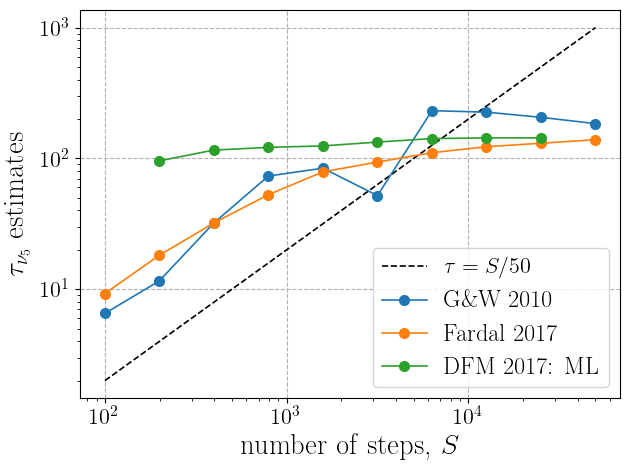

The 1D distribution of the parameters can be obtained through the :meth:`Sampler.plot_dist <DNNLikelihood.Sampler.plot_dist>` 
method:

.. code-block:: python

    sampler.plot_dist(pars=[0,5])

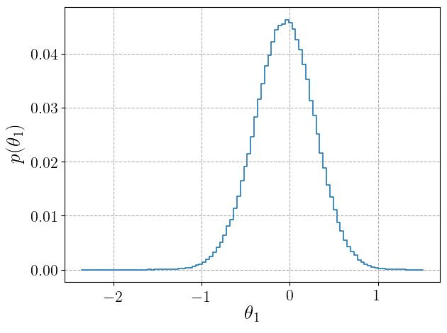

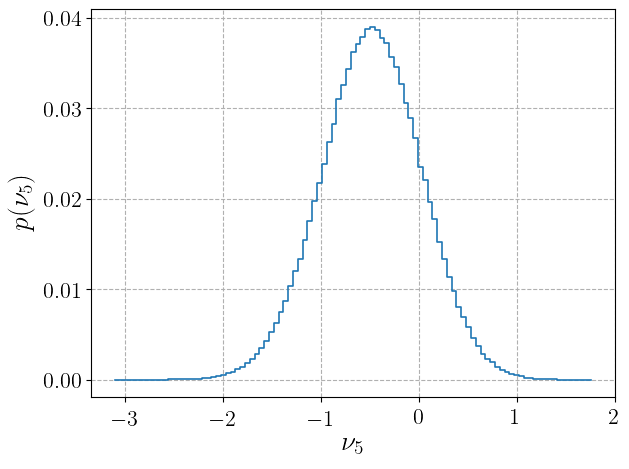

The last series of plots that can be automatically obtained are the parameters and logpdf evolution with the number of steps
for a given number of walkers.
They are produced by the :meth:`Sampler.plot_chains <DNNLikelihood.Sampler.plot_chains>` and 
:meth:`Sampler.plot_chains_logpdf <DNNLikelihood.Sampler.plot_chains_logpdf>` methods, respectively. For instance, one could plot
``30`` randomly selected walkers as follows:

.. code-block:: python

    sampler.plot_chains(pars=[0,5],n_chains=30)
    sampler.plot_chains_logprob(n_chains=30)

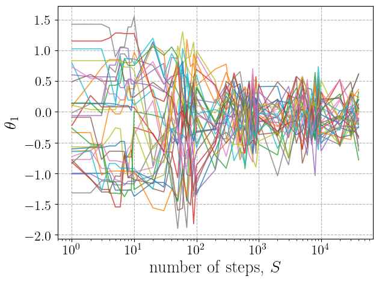

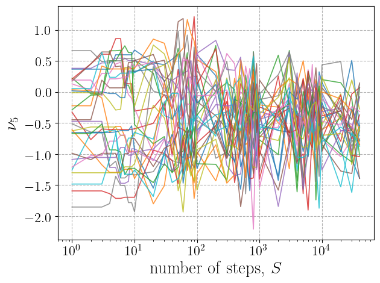

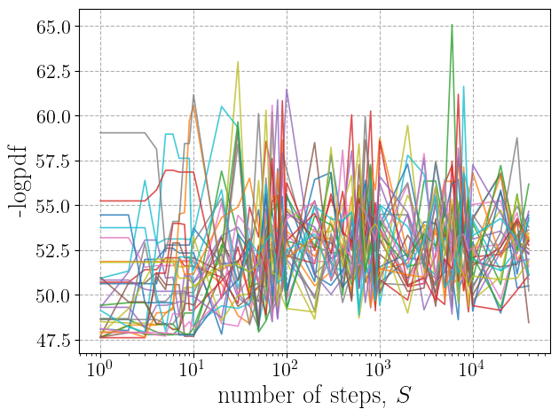

The full list of produced figures is saved in the :attr:`Sampler.figures_list <DNNLikelihood.Sampler.figures_list>` attribute:

.. code-block:: python

    sampler.figures_list()

    >>> ['<my_output_folder>/toy_sampler_figure_GR_Rc_0.pdf',
         '<my_output_folder>/toy_sampler_figure_GR_sqrtVhat_0.pdf',
         '<my_output_folder>/toy_sampler_figure_GR_sqrtW_0.pdf',
         '<my_output_folder>/toy_sampler_figure_GR_Rc_5.pdf',
         '<my_output_folder>/toy_sampler_figure_GR_sqrtVhat_5.pdf',
         '<my_output_folder>/toy_sampler_figure_GR_sqrtW_5.pdf',
         '<my_output_folder>/toy_sampler_figure_distr_0.pdf',
         '<my_output_folder>/toy_sampler_figure_distr_5.pdf',
         '<my_output_folder>/toy_sampler_figure_autocorr_0.pdf',
         '<my_output_folder>/toy_sampler_figure_autocorr_5.pdf',
         '<my_output_folder>/toy_sampler_figure_chains_0.pdf',
         '<my_output_folder>/toy_sampler_figure_chains_5.pdf',
         '<my_output_folder>/toy_sampler_figure_chains_logpdf.pdf']

The :attr:`Sampler.nsteps_required <DNNLikelihood.Sampler.nsteps_required>` can be increased at any time, and the method 
:meth:`Sampler.run_sampler <DNNLikelihood.Sampler.run_sampler>` can be called again to run the steps missing to reach 
:attr:`Sampler.nsteps_required <DNNLikelihood.Sampler.nsteps_required>`. For instance, one can run for another 20K steps through:

.. code-block:: python

    sampler.nsteps_required = 70000
    sampler.run_sampler()

Once a satisfactory sampling has been obtained, a :mod:`Data <data>` object storing the
desired dataset (see :ref:`the Data object <data_object>`) can be generated. The dataset is obtained from the sampling 
by taking samples after a given ``burnin`` number of steps, and
to avoid large correlation between samples, by taking a step every ``thin`` (a fully unbiased sampling, that is a faithful
random number generator, would need ``thin`` of the same order or larger than the autocorrelation time). This is done with the
:meth:`Sampler.get_data_object <DNNLikelihood.Sampler.get_data_object>` method as follows:

.. code-block:: python

    data = sampler.get_data_object(nsamples=200000, burnin=5000, thin=2, dtype="float64", test_fraction=0)

This generates a :mod:`Data <data>` object with ``200000`` sampler obtained by discarding from the sampling the first
``5000`` steps and by taking one every ``2`` steps after (until the required ``nsamples`` is reached). If the number ``nsamples`` is
larger than the one available consistently with the ``burnin`` and ``thin`` options, then all available samples are taken (and a warning
message is printed). The user may choose the data type of the exported samples ``dtype`` (default is ``"float64"``), which is useful
to format data with the precision needed to train the DNNLikelihood. Finally, the user may already choose a ``test_fraction``, so that
data are divided, inside the :mod:`Data <data>` object, into two samples, one used to feed train (and validation) data 
and the other to be used as a test dataset. If ``test_fraction`` is left to the default value ``0``, it could simply be updated afterwards from
the :mod:`Data <data>` object itself.

As a final step we can save the state of the :class:`Sampler <DNNLikelihood.Sampler>` object by using the 
:meth:`Sampler.save <DNNLikelihood.Sampler.save>` method.

.. code-block:: python

    sampler.save(overwrite=True)

The user should remember that the default value of the ``overwrite`` argument for saving functions is ``False``. Therefore, in order not
to produce new files, ``overwrite=True`` should be explicitly specified when making intermediate or final saving of the objects.

.. include:: ../external_links.rst